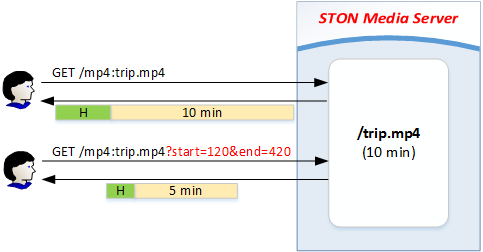
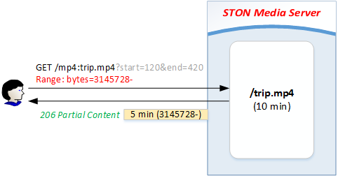

.. _content-transform:

13장. 미디어 가공
******************

이 장에서는 미디어를 동적으로 가공하여 서비스하는 방법에 대해 설명한다.
미디어는 클라이언트 환경과 서비스 형태에 따라 다양한 형태로 가공된다.
때문에 같은 콘텐츠이지만 여러 형태로 원본서버에 존재하게 된다.
이런 방식은 처리시간과 저장공간의 낭비로 이어질 뿐만 아니라 관리하기도 매우 어렵다.

.. toctree::
   :maxdepth: 2

.. _content-transform-trimming:

Trimming
====================================

시간 값을 기준으로 영상에서 원하는 구간을 추출한다.
Trimming은 전송단계에서만 발생할 뿐 원본의 형태를 변경하지 않는다.
별도의 저장공간을 사용하지 않는다. ::

   # server.xml - <Server><VHostDefault><Options>
   # vhosts.xml - <Vhosts><Vhost><Options>

   <ContentTransform>
       <MP4Trimming StartParam="start" EndParam="end" AllTracks="off">OFF</MP4Trimming>
   </ContentTransform>

-  ``<MP4Trimming>``

   - ``OFF (기본)`` 아무 것도 하지 않는다.

   - ``ON`` 확장자(.mp4, .m4a)가 일치하면 원하는 구간만큼 서비스하도록 Trimming한다.
     Trimming구간은 ``StartParam`` 속성과 ``EndParam`` 으로 설정한다.

   - ``AllTracks`` 속성

     - ``OFF (기본)`` Audio/Video 트랙만 Trimming한다. (Mod-H264 방식)

     - ``ON`` 모든 트랙을 Trimming한다. 사용 전 반드시 플레이어 호환성을 확인해야 한다.

파라미터는 클라이언트 QueryString을 통해 입력받는다.
예를 들어 10분 분량의 동영상(/trip.mp4)을 특정 구간만 Trimming하고 싶다면 QueryString에 원하는 시점(단위: 초)을 명시한다. ::

   // HTTP Pseudo-Streaming
   http://www.example.com/bar/mp4:trip.mp4                // 10분 : 전체 동영상
   http://www.example.com/bar/mp4:trip.mp4?end=60         // 1분 : 처음부터 60초까지
   http://www.example.com/bar/mp4:trip.mp4?start=120      // 8분 : 2분(120초)부터 끝까지
   http://www.example.com/bar/mp4:trip.mp4?start=3&end=13 // 10초 : 3초부터 13초까지

   // Apple iOS device (Cupertino/Apple HTTP Live Streaming)
   http://www.example.com/bar/mp4:trip.mp4/playlist.m3u8?start=3&end=13

   // Adobe Flash Player (RTMP)
   Server: rtmp://www.example.com/bar
   Stream: mp4:trip.mp4?start=3&end=13

``StartParam`` 값이 ``EndParam`` 값보다 클 경우 구간이 지정되지 않은 것으로 판단한다.

이 기능은 파일을 단순히 자르기만 하는 것이 아니라 올바르게 재생될 수 있도록 키프레임등 미디어 파일을 분석하여 구간을 추출한다.
클라이언트에게 전달되는 파일은 다음 그림처럼 MP4헤더가 재생성된 완전한 형태의 MP4파일이다.

   완전한 형태의 파일이 제공된다.

추출된 구간은 별도의 파일로 인식되기 때문에 200 OK로 응답된다.
그러므로 다음과 같이 Range헤더가 명시된 경우 추출된 파일로부터 Range를 계산하여 **206 Particial Content** 로 응답한다.

   일반적인 Range요청처럼 처리된다.

구간추출 파라미터가 QueryString 표현을 사용하기 때문에 자칫 :ref:`caching-policy-applyquerystring` 과 헷갈릴 수 있다.
``<ApplyQueryString>`` 설정이 ``ON`` 인 경우 클라이언트가 요청한 URL의 QueryString이 모두 인식되지만 ``StartParam`` 과 ``EndParam`` 은 제거된다. ::

   GET /bar/mp4:trip.mp4?start=30&end=100
   GET /bar/mp4:trip.mp4?tag=3277&start=30&end=100&date=20130726

예를 들어 위와 같이 ``StartParam`` 이 **start** 로 ``EndParam`` 이 **end** 로 입력된 경우
이 값들은 구간을 추출하는데 쓰일 뿐 Caching-Key를 생성하거나 원본서버로 요청을 보낼 때는 제거된다.
각각 다음과 같이 인식된다. ::

   GET /bar/mp4:trip.mp4
   GET /bar/mp4:trip.mp4?tag=3277&date=20130726

.. _content-transform-trimming:

Multi-Trimming
====================================

시간 값을 기준으로 복수로 지정된 구간을 하나의 영상으로 추출한다.

.. figure:: img/conf_media_multitrimming.png
   :align: center

   /mp4:trip.mp4?trimming=0-30,210-270,525-555

구간 지정방법만 다를뿐 동작방식은 `Trimming`_ 과 동일하다. ::

   # server.xml - <Server><VHostDefault><ContentTransform>
   # vhosts.xml - <Vhosts><Vhost><ContentTransform>

   <MP4Trimming MultiParam="trimming" MaxRatio="50">OFF</MP4Trimming>

-  ``<MP4Trimming>``

   - ``MultiParam (기본: "trimming")``
     설정된 이름을 QueryString Key로 사용하여 추출 구간을 지정한다.
     하나의 구간은 "시작시간 - 종료시간" 으로 표기하며 각 구간은 콤마(,)로 연결한다.

   - ``MaxRatio (기본: 50%)``
     Multi-Trimming된 영상은 원본보다 ``MaxRatio (최대 100%)`` 비율만큼까지 커질 수 있다.
     ``MaxRatio`` 를 넘어가는 구간은 무시된다.

예를 들어 다음과 같이 호출하면 3분짜리 영상이 생성된다. ::

   // HTTP Pseudo-Streaming
   http://www.example.com/bar/mp4:trip.mp4?trimming=10-70,560-620,1245-1305

   // Apple iOS device (Cupertino/Apple HTTP Live Streaming)
   http://www.example.com/bar/mp4:trip.mp4/playlist.m3u8?trimming=10-70,560-620,1245-1305

   // Adobe Flash Player (RTMP)
   Server: rtmp://www.example.com/bar
   Stream: mp4:trip.mp4?trimming=10-70,560-620,1245-1305

같은 영상을 반복하거나 앞 뒤가 바뀐 영상을 만들 수도 있다. ::

   // HTTP Pseudo-Streaming
   http://www.example.com/mp4:trip.mp4?trimming=17-20,17-20,17-20,17-20
   http://www.example.com/mp4:trip.mp4?trimming=1000-1200,500-623,1900-2000
   http://www.example.com/mp4:trip.mp4?trimming=600-,400-600

구간 값을 지정하지 않은 경우 맨 앞 또는 맨 뒤를 의미한다.

.. note::

   `Multi-Trimming`_ 은 `Trimming`_ 보다 우선한다.
   QueryString에 `Multi-Trimming`_ 키가 명시되어 있다면 `Trimming`_ 키는 무시된다.

