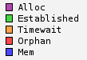
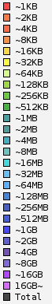
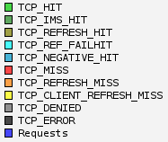
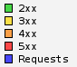
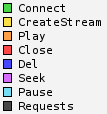

.. _api-graph:

Appendix A: Graph
******************

모든 MRTG통계는 PNG포맷 그래프로 제공된다.
호출 규칙은 자원 뒤에 단위가 붙는 형식이다. ::

    # 5가지의 CPU 그래프 (dash, day, week, month, year)
    http://127.0.0.1:20040/graph/cpu_dash.png
    http://127.0.0.1:20040/graph/cpu_day.png
    http://127.0.0.1:20040/graph/cpu_week.png
    http://127.0.0.1:20040/graph/cpu_month.png
    http://127.0.0.1:20040/graph/cpu_year.png

모든 그래프는 5가지 타입으로 제공된다.

======= =========== =========== =============
타입    크기       시간단위     기간
======= =========== =========== =============
dash    205 X 175   5분         12시간
day     580 X 203   5분         2일 (48시간)
week    580 X 203   30분        2주 (14일)
month   580 X 203   2시간       7주
year    580 X 203   1일         18개월
======= =========== =========== =============

한 그래프에는 최소 1개에서 최대 3개의 선이 그려진다.
Main 라인은 녹색, Sub 라인은 파란색으로 그려진다.
또한 "Week" 그래프 이상부터는 Peak 라인이 제공된다.
Peak 라인은 이전 단위에서 가장 큰 수치를 핑크색으로 그린다.

.. note:

   너무 많은 그래프를 동시에 그릴 경우 CPU사용량이 과도하게 높아져 서비스 품질저하가 발생할 수 있다.
   이를 방지하기 위해 항상 한번에 하나의 그래프만 그리도록 관리한다.

.. toctree::
   :maxdepth: 2

.. _api-graph-global:

전역자원
====================================

전역자원 그래프는 시스템 상태 또는 STON 미디어 서버와 관련된 자원들에 대해 서비스한다.
아래 목록에서 *는 타입(dash, day, week, month, year) 중 한 가지를 의미한다.

CPU
---------------------
::

    /graph/cpu_*.png

-  ``Main`` Kernel + User
-  ``Sub`` Kernel

STON 미디어 서버 CPU
---------------------
::

    /graph/ston_media_server_cpu_*.png

-  ``Main`` Kernel + User
-  ``Sub`` Kernel

메모리
---------------------
::

    /graph/mem_*.png

-  ``Main`` 전체 사용량
-  ``Sub`` STON 미디어 서버 사용량

IO Wait
---------------------
::

    /graph/iowait_*.png

-  ``Main`` IO Wait

Load Average
---------------------
::

    /graph/loadavg_*.png

-  ``Main`` Load Average

서버소켓 이벤트
---------------------
::

    /graph/ssockevent_*.png

클라이언트와 STON 미디어 서버의 소켓연결 이벤트를 의미한다.

-  ``Main`` Accepted
-  ``Sub`` Closed

서버소켓 사용량
---------------------
::

    /graph/ssockusage_*.png

클라이언트와 STON 미디어 서버의 연결 수를 의미한다.

-  ``Main`` 전체
-  ``Sub`` Established

클라이언트소켓 이벤트
---------------------
::

    /graph/csockevent_*.png

STON 미디어 서버와 원본서버의 소켓연결 이벤트를 의미한다.

-  ``Main`` Connected
-  ``Sub`` Closed

클라이언트소켓 사용량
---------------------
::

    /graph/csockusage_*.png

STON 미디어 서버와 원본서버의 연결 수를 의미한다.

-  ``Main`` 전체
-  ``Sub`` Established

차단된 IP접근
---------------------
::

    /graph/acldenied_*.png

-  ``Main`` 차단된 클라이언트

이벤트 큐
---------------------
::

    /graph/eq_*.png

-  ``Main`` 이벤트 큐 길이

TCP소켓
---------------------
::

    /graph/tcpsocket_*.png

.. _api-graph-vhost:

가상호스트
====================================

가상호스트 그래프는 전체 또는 개별 가상호스트의 상태에 대해 서비스한다.
vhost파라미터를 이용하여 특정 가상호스트를 지정할 수 있으며,
생략된 경우 전체 가상호스트의 합을 제공한다. ::

    http://127.0.0.1:20040/graph/vhost/mem_day.png?vhost=www.example.com

원본/클라이언트 트래픽의 경우 프로토콜별 그래프가 제공된다. 프로토콜 변수는 ``protocol`` 로 지정한다. ::

    http://127.0.0.1:20040/graph/vhost/client_traffic_*.png?vhost=www.example.com&protocol=all

``protocol`` 의 값은 ``all (기본)`` , ``rtmp`` , ``http`` , ``hls`` ,  ``mpegdash`` 중 선택할 수 있다.
프로토콜별 그래프를 지원하는 경우 소제목 옆에 지원 프로토콜을 을 명시한다.

아래 목록에서 *는 타입(dash, day, week, month, year) 중 한 가지를 의미한다.

콘텐츠개수
---------------------
::

    /graph/vhost/filecount_*.png

콘텐츠 메모리
---------------------
::

    /graph/vhost/mem_*.png

-  ``Main`` 메모리에 적재된 콘텐츠 데이터량

히트율 ``all`` ``rtmp`` ``http`` ``hls`` ``mpegdash``
---------------------
::

    /graph/vhost/hitratio_*.png

-  ``Main`` Request Hit Ratio
-  ``Sub`` Byte Hit Ratio

클라이언트 세션 ``all`` ``rtmp`` ``http`` ``hls`` ``mpegdash``
---------------------
::

    /graph/vhost/client_session_*.png

-  ``Main`` 전체 클라이언트 세션
-  ``Sub`` 전송 진행 중인 클라이언트 세션

클라이언트 트래픽 ``all`` ``rtmp`` ``http`` ``hls`` ``mpegdash``
---------------------
::

    /graph/vhost/client_traffic_*.png

-  ``Main`` Inbound
-  ``Sub`` Outbound

클라이언트 응답 ``all`` ``rtmp`` ``http`` ``hls`` ``mpegdash``
---------------------
::

    /graph/vhost/client_res_*.png

-  ``Main`` 클라이언트 응답횟수
-  ``Sub`` 클라이언트 요청횟수

클라이언트 트랜잭션 ``http`` ``hls`` ``mpegdash``
---------------------
::

    /graph/vhost/client_res_complete_*.png

-  ``Main`` 완료된 클라이언트 응답횟수
-  ``Sub`` 클라이언트 요청횟수

클라이언트 응답시간 ``all`` ``rtmp`` ``http`` ``hls`` ``mpegdash``
---------------------
::

    /graph/vhost/client_res_time_*.png

-  ``Main`` 클라이언트 요청에 대한 응답시간

클라이언트 완료시간 ``http`` ``hls`` ``mpegdash``
---------------------
::

    /graph/vhost/client_res_complete_time_*.png

-  ``Main`` 클라이언트 요청에 대한 트랜잭션 완료시간

클라이언트 캐싱응답 ``all`` ``rtmp`` ``http`` ``hls`` ``mpegdash``
---------------------
::

    /graph/vhost/client_res_hit_*.png

클라이언트 상세응답 ``rtmp`` ``http`` ``hls`` ``mpegdash``
---------------------
::

    /graph/vhost/client_http_res_detail_*.png
    /graph/vhost/client_hls_res_detail_*.png
    /graph/vhost/client_mpegdash_res_detail_*.png

::

    /graph/vhost/client_rtmp_res_detail_*.png

원본서버 세션 ``all`` ``http`` ``hls`` ``mpegdash``
---------------------
::

    /graph/vhost/origin_session_*.png

-  ``Main`` 전체 원본 세션
-  ``Sub`` 전송 진행 중인 원본 세션

원본서버 트래픽 ``all`` ``http`` ``hls`` ``mpegdash``
---------------------
::

    /graph/vhost/origin_traffic_*.png

-  ``Main`` Inbound
-  ``Sub`` Outbound

원본서버 응답 ``all`` ``http`` ``hls`` ``mpegdash``
---------------------
::

    /graph/vhost/origin_res_*.png

-  ``Main`` 원본 응답횟수
-  ``Sub`` 원본 요청횟수

원본서버 트랜잭션 ``http`` ``hls`` ``mpegdash``
---------------------
::

    /graph/vhost/origin_res_complete_*.png

-  ``Main`` 완료된 원본서버 응답횟수
-  ``Sub`` 원본서버 요청횟수

원본서버 응답시간 ``http`` ``hls`` ``mpegdash``
---------------------
::

    /graph/vhost/origin_res_time_*.png

-  ``Main`` 원본서버에 보낸 요청에 대한 응답시간

원본서버 완료시간 ``http`` ``hls`` ``mpegdash``
---------------------
::

    /graph/vhost/origin_res_complete_time_*.png

-  ``Main`` 원본서버에 보낸 요청에 대한 트랜잭션 완료시간

원본서버 상세응답 ``http`` ``hls`` ``mpegdash``
---------------------
::

    /graph/vhost/origin_http_res_detail_*.png
    /graph/vhost/origin_hls_res_detail_*.png
    /graph/vhost/origin_mpegdash_res_detail_*.png

