.. _multi-protocol-live:

[v1.x] 5장. LIVE
******************

이 장에서는 STON 미디어 서버의 LIVE 서비스 구성에 대해 설명한다.
STON 미디어 서버는 원본 LIVE 스트림으로부터 Push받거나, 게시된 원본 LIVE 스트림을 Pull방식으로 수신할 수 있다. 
두 방식을 혼용하면 쉽게 확장이 가능한 LIVE 서비스를 구성할 수 있다.

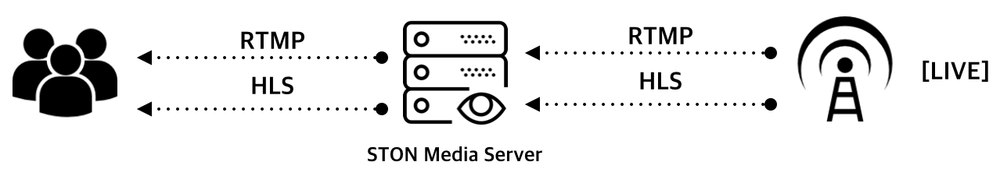

가상호스트의 ``Type`` 속성이 반드시 Live로 설정되어 있어야 한다. ::

    # vhosts.xml

    <Vhosts>
        <Vhost Name="www.example.com/bar" Type="LIVE">
            ...
        </Vhost>
    </Vhosts>

.. note::

   STON 미디어 서버는 LIVE 소스를 트랜스코딩(Transcoding)하지 않는다. 

프로토콜별 URL 표현은 :ref:`multi-protocol-url` 을 참고한다. 
다른 프로토콜간 변환이 발생할 때(RTMP to HLS/HLS to RTMP) 기술적인 제약사항을 고려해야 한다.

.. warning::

   VOD와 LIVE는 동적으로 변경할 수 없다. 
   같은 이름의 가상호스트를 사용하려면 삭제 후 다시 추가해주어야 한다.

.. toctree::
   :maxdepth: 2

.. _multi-protocol-live-channel:

채널(Channel)
====================================

채널(Channel)은 1개의 LIVE 서비스를 의미한다.
채널은 첫번째 참가자(Participant)에 의해 생성되고, 마지막 참가자와의 연결이 종료되면 자동으로 파괴된다. 
참가자(Participant)는 LIVE를 시청하는 클라이언트 또는 LIVE 인코더(Encoder)를 의미한다.

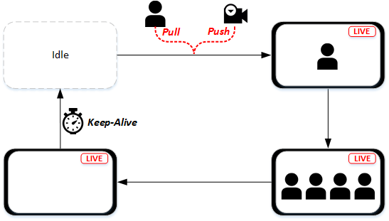

   채널의 생애(Life Cycle)

하나의 가상호스트는 별도의 설정 없이도 여러 채널을 동시에 서비스할 수 있다.

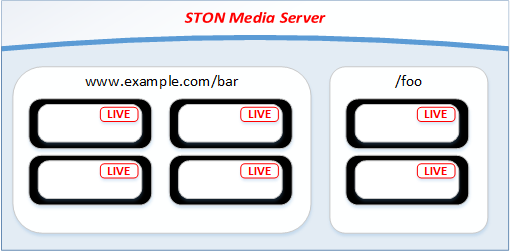

   1가상호스트 - 멀티 채널

단, 가상호스트에 속한 모든 채널의 원본 프로토콜은 동일해야 한다.

.. note::

   채널은 LIVE의 특성상 메모리만을 이용해 동작한다. 
   따라서 생성할 수 있는 채널의 수는 메모리 크기에 따라 다르다.
   예를 들어 사용가능한 메모리 크기가 10GB이고 채널 하나당 10MB를 소비한다면 약 1,000개의 채널이 서비스 가능하다.
   메모리 한계를 초과할 경우 채널이 생성되지 않는다.

.. _multi-protocol-live-channel-create:

생성
------------------------------------

LIVE 소스와 통신할 프로토콜을 지정해주어야 한다. ::

    # vhosts.xml

    <Vhosts>
        <Vhost Name="www.example.com/bar" Type="LIVE">
            <Origin Protocol="RTMP.Push">
               ...
            </Origin>
        </Vhost>
    </Vhosts>

-  ``<Origin>``

   - ``Protocol (기본: RTMP.Push)`` LIVE 채널이 LIVE 소스(인코더 또는 원본서버)와 통신할 프로토콜( ``RTMP.Push`` , ``RTMP.Pull`` , ``HLS.Pull`` )을 설정한다.
     채널이 생성되면 ``Protocol`` 이 변경되어도 반영되지 않는다.

클라이언트 요청 프로토콜과 상관없이 ``<Origin Protocol="...">`` 설정으로 원본서버와 통신한다.
채널이 생성되는 경우는 3가지 이다.

- ``RTMP.Push`` 인코더로부터 LIVE 스트림이 RTMP로 Push되는 경우
- ``RTMP.Pull`` 클라이언트가 LIVE 스트림을 RTMP로 요청(Pull)하는 경우
- ``HLS.Pull`` 클라이언트가 LIVE 스트림을 HLS로 요청(Pull)하는 경우

.. note::

   누구나 채널을 생성(Push 또는 Pull)할 수 있다. 
   이를 제한하고 싶다면 "서버접근제어" 나 "가상호스트 접근제어"를 사용한다. 
   http://ston.readthedocs.io/ko/latest/admin/access_control.html <http://ston.readthedocs.io/ko/latest/admin/access_control.html>`_

.. _multi-protocol-live-channel-scaleout:

확장
------------------------------------

채널을 손쉽게 확장하기 위해서는 STON 미디어 서버를 2계층으로 구성할 것을 권장한다.

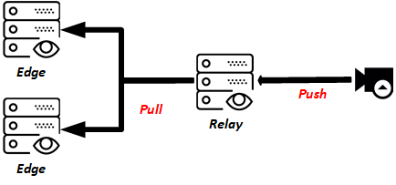

   중규모 채널구성

Relay 서버는 LIVE 소스(주로 인코더)로부터 LIVE 스트림을 Push받는다.
Edge 서버는 클라이언트 요청에 의해(=On demand) LIVE 스트림을 Relay 서버로부터 Pull한다.

더 많은 사용자에게 서비스하기 위해 다음과 같이 3계층 구성도 사용된다.

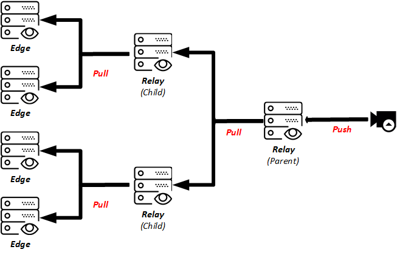

   대규모 채널구성

.. _multi-protocol-live-channel-destroy:

파괴
------------------------------------

채널에 연결된 참가자가 없을 경우 ``<ClientKeepAliveSec>`` 시간(초)만큼 채널을 유지한 뒤 파괴된다. ::

   # server.xml - <Server><VHostDefault><OriginOptions>
   # vhosts.xml - <Vhosts><Vhost><OriginOptions>
   
   <Rtmp>
      <ClientKeepAliveSec>60</ClientKeepAliveSec>
   </Rtmp>

   <Hls>
      <ClientKeepAliveSec>60</ClientKeepAliveSec>
   </Hls>

-  ``<ClientKeepAliveSec> (기본: 60초)``
   마지막 클라이언트의 연결이 종료된 후 설정된 시간(초)만큼 경과 후 채널을 파괴한다.

(HLS처럼) 클라이언트가 항상 채널에 연결되어 있는 것은 아니다.
채널을 즉시 파괴하면 자칫 너무 많은 생성/파괴가 발생할 수 있으며 이는 서비스 품질에 좋지 않은 영향을 줄 수 있다.
따라서 서비스 특성에 맞추어 일정시간 채널을 유지하도록하여 서비스 품질을 보장한다.

.. _multi-protocol-live-adobe-rtmp:

Adobe RTMP
====================================

Adobe RTMP를 이용해 인코더로부터 LIVE 스트림을 Push받거나, 게시된 LIVE 스트림을 RTMP로 Pull한다.

.. figure:: img/sms_live_workflow_rtmp.png
   :align: center

가상호스트는 반드시 Push 또는 Pull 중 한가지 방식을 선택해야 한다. 
이하 Push/Pull 사이에 혼동을 방지하기 위해 세부 주제 앞에 동작방식을 명시한다.

.. _multi-protocol-live-adobe-rtmp-push-basic:

[Push] 기본동작
------------------------------------

LIVE 스트림을 인코더로부터 직접 Push받을 수 있다. 
아래와 같이 ``Protocol="RTMP.push"`` 설정으로 동작하며 원본서버 주소가 필요하지 않다. ::

    # vhosts.xml

    <Vhosts>
        <Vhost Name="www.example.com/bar" Type="LIVE">
            <Origin Protocol="RTMP.push" />
        </Vhost>
    </Vhosts>

가상호스트가 생성되었다면 별도의 설정없이 여러 스트림을 동시에 Push받을 수 있다.

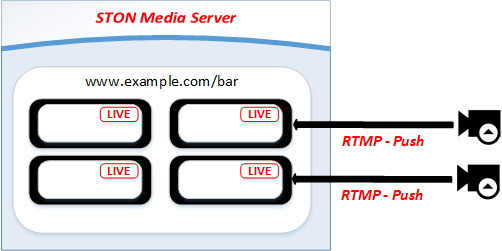

   Push받을 때 채널이 생성된다.

.. _multi-protocol-live-adobe-rtmp-push-multisource:

[Push] 다중화
------------------------------------

같은 URL로 복수의 Live 스트림이 Push되는 경우 가장 먼저 연결된 스트림이 Active 소스가 되며 나머지는 Standby 소스가 된다. 

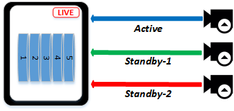

   RTMP Push - 멀티소스 구성

.. note::

   소스는 최대 3개 (1 Active, 2 Standby)까지 구성이 가능하다.

Active 소스와 연결이 종료되면 연결된 순서대로 Standby 소스가 Active 소스로 승격된다.

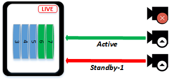

   RTMP Push - Active 장애발생 처리

이 때 각 소스간 서로 다른 Timestamp를 사용하여도 최초 Active 소스의 Timestamp가 승계되어 매끄러운(Seamless) 재생환경을 구성한다.

.. _multi-protocol-live-adobe-rtmp-push-abr-streaming:

[Push] ABR 스트리밍
------------------------------------

LIVE 스트림 Push를 통해 ABR(Adaptive bitrate) 스트리밍(streaming)을 구성할 수 있다.
이를 위해서는 개별로 Push되는 스트림을 하나의 ABR 스트림으로 묶어 주어야 한다.

기본적으로 STON 미디어 서버는 같은 소스를 다양한 Bitrate로 Push 해도 이를 알지 못하며, 다음처럼 각기 다른 LIVE 스트림으로 인식한다.

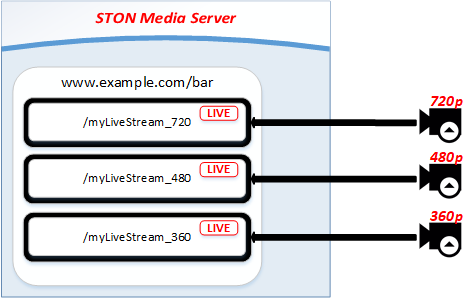

ABR 스트리밍은 사전에 패턴을 등록하여 동작한다. ::

   # vhosts.xml - <Vhosts><Vhost><OriginOptions><Rtmp>
   
   <ABR>
      <Stream Name="*_abr">
        <Pattern>*_720</Pattern>
        <Pattern>*_480</Pattern>
        <Pattern>*_360</Pattern>
      </Stream>
   </ABR>

-  ``<ABR>``
   ABR로 구성할 스트림을 등록한다.

-  ``<Stream>``
   하위의 멀티 ``<Pattern>`` 을 하나의 ABR 스트림으로 구성한다.
   구성된 ABR 스트림은 ``Name`` 을 URL로 접근이 가능하다.

위와 같은 구성하고 다음처럼 각기 다른 Bitrate의 스트림들이 Push되었다고 가정해 보자. ::

   /myLiveStream_720
   /myLiveStream_480
   /myLiveStream_360

"/myLiveStream_" 은 패턴 "*_"와 일치한다. 위의 세개의 스트림은 아래의 ABR 스트림으로 구성된다. ::

   /myLiveStream_abr         -> /myLiveStream_720 + /myLiveStream_480 + /myLiveStream_360

그림으로 표현하면 아래와 같다.

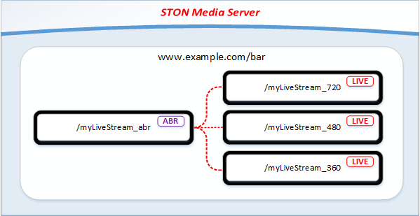

조금 더 복잡한 예로, 아래와 같이 동시에 여러 Live 스트림이 입력된 상황을 가정해 보자.
(일치하는 패턴은 우측에 명시하였다.) ::

   /myLiveStream_720          (*_720)
   /myLiveStream_480          (*_480)
   /myLiveStream_360          (*_360)
   /AliceLive_720             (*_720)
   /AliceLive_360             (*_360)
   /JamesLive_720_clips          X
   /JamesLive_360_clips          X
   /JohnLive_1080                X
   /JohnLive_720              (*_720)
   /cctv                         X

이때 구성되는 ABR 스트림은 다음과 같다. ::

   /myLiveStream_abr          -> /myLiveStream_720 + /myLiveStream_480 + /myLiveStream_360
   /AliceLive_abr             -> /AliceLive_720 + /AliceLive_360
   /JohnLive_abr              -> /JohnLive_720
   
그림으로 표현하면 아래와 같다.

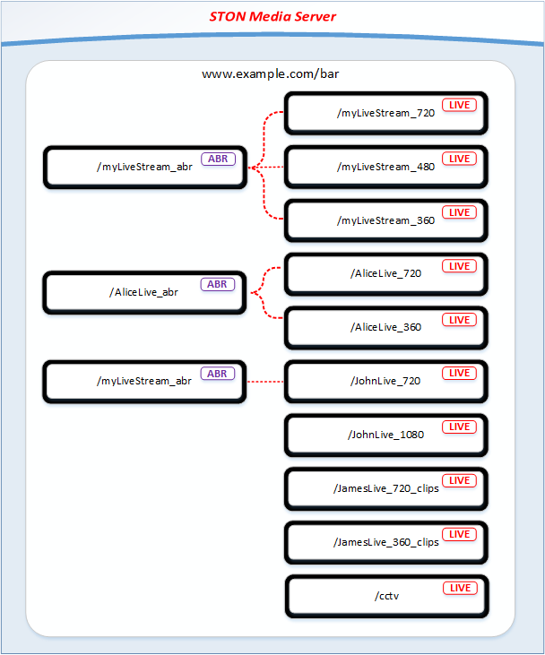

    .. figure:: img/sms_live_channel_multi.png
       :align: center

이와 같은 방식은 각 스트림 이름을 정확히 알지 못해도 패턴만으로 ABR 스트림 구성을 자동화할 수 있다는 장점이 있다.

.. _multi-protocol-live-adobe-rtmp-pull-basic:

[Pull] 기본동작
------------------------------------

최초 클라이언트 요청이 발생하면 LIVE 스트림을 원본서버로부터 Pull한다.
아래와 같이 ``Protocol="RTMP.Pull"`` 설정으로 동작한다. ::

    # vhosts.xml

    <Vhosts>
        <Vhost Name="www.example.com/bar" Type="LIVE">
            <Origin Protocol="RTMP.Pull">
               ...
            </Origin>
        </Vhost>
    </Vhosts>

가상호스트가 생성되었다면 별도의 설정없이 여러 스트림을 동시에 Pull할 수 있다.

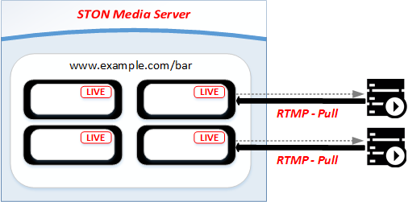

   클라이언트 요청에 의해 채널이 생성된다.

.. _multi-protocol-live-adobe-rtmp-pull-multisource:

[Pull] 다중화
------------------------------------

Active 소스와 연결이 성립되면(=채널이 정상적으로 생성되면) Standby 소스를 확보하기 위해 모든 원본서버 주소로 LIVE 스트림을 요청한다.

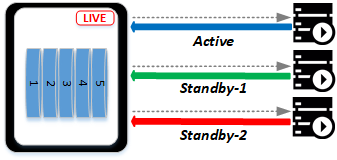

   RTMP Pull - 멀티소스 구성

.. note::

   소스는 최대 3개 (1 Active, 2 Standby)까지 구성이 가능하다.

Active 소스와 연결이 종료되면 확보된 순서대로 Standby 소스가 Active 소스로 승격된다.

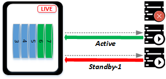

   RTMP Pull - Active 장애발생 처리

이 때 각 소스간 서로 다른 Timestamp를 사용하여도 최초 Active 소스의 Timestamp가 승계되어 매끄러운(Seamless) 재생환경을 구성한다.

.. _multi-protocol-live-adobe-rtmp-to-rtmp:

RTMP to RTMP 전송
------------------------------------

LIVE 소스로부터 수신 받은 RTMP 스트림을 가공없이 RTMP 클라이언트에게 전송한다. 
대부분 :ref:`multi-protocol-vod-adobe-rtmp-session` 설정을 그대로 사용하지만, ``<BufferSize>`` 의 의미가 다르다. ::

   # server.xml - <Server><VHostDefault><Options><Rtmp>
   # vhosts.xml - <Vhosts><Vhost><Options><Rtmp>
   
   <BufferSize>3</BufferSize>

-  ``<BufferSize> (기본: 3초)``
   클라이언트가 PLAY를 요청했을 때 "현재시점"에서 설정된 시간(초) 이전부터 전송한다.

      .. figure:: img/sms_live_rtmp_buffersize.png
         :align: center
      
   값이 0이라면 PLAY 요청 시 채널의 "현재시점"을 전송한다. 

LIVE 서비스의 특성상 방송 시점과 클라이언트 시청 시점의 차이가 짧을수록 좋다.

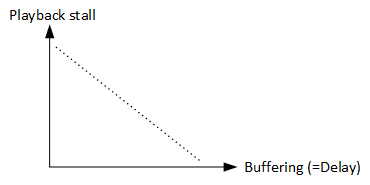

   BufferSize , 시점, 네트워크 안정성, 원활한 재생의 관계

하지만 3G/공용Wi-Fi 등 불안정한 네트워크 환경이라면 영상이 자주 끊기는 등 재생이 원활하지 않을 가능성이 높다.
클라이언트가 일정시간을 버퍼링한다면 순간적인 네트워크 지연에도 끊김없는 재생이 가능하다.

.. _multi-protocol-live-apple-rtmp-to-hls:

RTMP to HLS 전송
------------------------------------

HLS 전송을 위해서는 RTMP 스트림을 Packetizing해야 한다.
:ref:`multi-protocol-vod-apple-hls-session` , :ref:`multi-protocol-vod-apple-hls-packetizing` 설정을 그대로 사용한다.
다른 점에 대해서만 설명한다. ::

   # server.xml - <Server><VHostDefault><Options><Hls>
   # vhosts.xml - <Vhosts><Vhost><Options><Hls>

   <Packetizing Status="Active">
      <Index Ver="3" Alternates="ON">index.m3u8</Index>
      <Sequence>0</Sequence>
      <Duration ChunkCount="3">10</Duration>
      <AlternatesName>playlist.m3u8</AlternatesName>
      <MP3SegmentType>TS</MP3SegmentType>
   </Packetizing>

-  ``<Packetizing>`` 채널이 이미 생성되었다면 ``<Packetizing>`` 및 하위 설정의 값을 바꾸어도 적용되지 않는다.

-  ``<Duration> (기본: 10초)`` 스트리밍(Streaming)된 데이터가 Duration동안 저장되면 Chunk가 생성되고 인덱스파일(m3u8)이 갱신된다.

   - ``ChunkCount (기본 3)`` 인덱스파일(m3u8)에서 제공할 Chunk개수를 지정한다.

RTMP를 HLS로 변환할 때는 Streaming되는 Audio/Video를 Chunk(MPEG2-TS)파일로 만들어야 한다. 
(기본 ``<Duration>`` 설정인 경우) RTMP를 이용한 LIVE가 진행되면 신규 유저에게 제공되는 HLS는 아래와 같다.

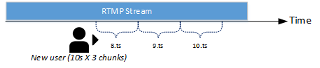
   
   RTMP시점보다 30초 전 시점부터 시청한다.

RTMP의 "현재시점" 과 최대한 맞추기 위해서는 ``<Duration>`` 을 줄일 필요가 있다. ::

   # server.xml - <Server><VHostDefault><Options><Hls>
   # vhosts.xml - <Vhosts><Vhost><Options><Hls>

   <Packetizing>
      <Duration ChunkCount="3">2</Duration>
   </Packetizing>

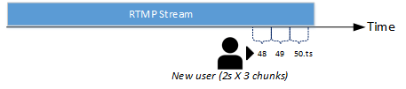

   RTMP시점보다 6초 전 시점부터 시청한다.

.. note::

   채널이 HLS 클라이언트에 의해 생성되었다면 해당 클라이언트는 최대 ``<Duration>`` 만큼 기다려야 한다. 
   첫번째 Chunk가 생성된 이후부터 HLS 전송이 가능하기 때문이다.

.. _multi-protocol-live-apple-hls:

Apple HLS
====================================

원본서버에서 HTTP로 다운로드한 영상을 HLS(HTTP Live Streaming)으로 전송한다.

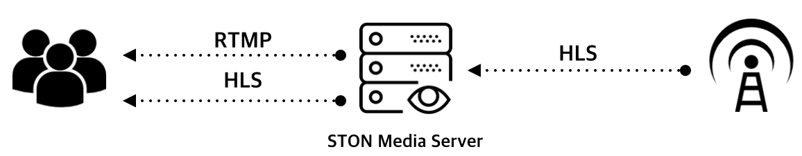

모든 인덱스/Chunk 파일은 동적으로 생성되며 별도의 저장공간을 소비하지 않는다.
서비스 시점에 임시적으로 생성되며 서비스가 끝나면 사라진다.

.. _multi-protocol-live-apple-hls-pull-basic:

[Pull] 기본동작
------------------------------------

최초 클라이언트 요청이 발생하면 LIVE 원본서버로부터 Pull한다.
아래와 같이 ``Protocol="HLS.Pull"`` 설정으로 동작한다. ::

    # vhosts.xml

    <Vhosts>
        <Vhost Name="www.example.com/bar" Type="LIVE">
            <Origin Protocol="HLS.Pull">
               ...
            </Origin>
        </Vhost>
    </Vhosts>

가상호스트가 생성되었다면 별도의 설정없이 여러 스트림을 동시에 Pull할 수 있다.

   Pull하면 채널이 생성된다.

.. _multi-protocol-live-apple-hls-pull-multisource:

[Pull] 다중화
------------------------------------

Active 소스와 연결이 성립되면(=채널이 정상적으로 생성되면) Standby 소스를 확보하기 위해 모든 원본서버 주소로 HLS를 요청한다.

   HLS Pull - 멀티소스 구성

.. note::

   소스는 최대 3개 (1 Active, 2 Standby)까지 구성이 가능하다.

Active 소스와 연결이 종료되면 확보된 순서대로 Standby 소스가 Active 소스로 승격된다.

   HLS Pull - Active 장애발생 처리

이 때 각 소스간 서로 다른 Timestamp를 사용하여도 최초 Active 소스의 Timestamp가 승계되어 매끄러운(Seamless) 재생환경을 구성한다.

.. _multi-protocol-live-apple-hls-session:

HLS to HLS 전송
------------------------------------

LIVE 소스로부터 수신 받은 HLS을 별도로 Packetizing하지 않고 HLS 클라이언트에게 전송한다. 

.. _multi-protocol-live-apple-hls-session:

HLS to RTMP 전송
------------------------------------

RTMP 전송을 위해서는 HLS의 Chunk들을 RTMP 스트림으로 변환해야 한다. 

.. warning::

   목적이 분명하지 않아 스펙이 구체화되지 않았다.
