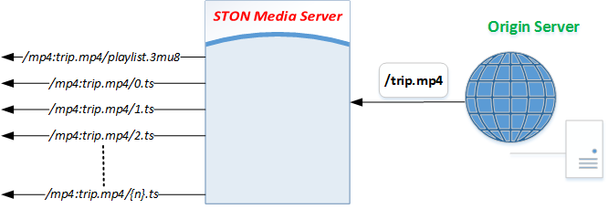

.. _multi-protocol-url:

[v1.x] 5장. 프로토콜/URL
******************

이 장에서는 프로토콜에 따른 URL표현에 대해 설명한다. 
URL은 VOD(Video On Demand)와 LIVE 공통이다. ::

    # vhosts.xml

    <Vhosts>
        <Vhost Name="www.example.com/bar">
            ...
        </Vhost>
    </Vhosts>

.. toctree::
   :maxdepth: 2

.. _multi-protocol-url-adobe-rtmp:

Adobe RTMP
====================================

STON 미디어 서버는 RTMP(Real Time Messaging Protocol)를 이용해 VOD/LIVE를 전송한다.
Adobe Flash Player의 NetConnection 객체를 이용해 연결하고 NetStream 객체를 통해 스트리밍한다.
RTMP URL 형식은 다음과 같다. ::

   rtmp://{virtual-host}/{stream-name}
   rtmp://{ston-ip-address}/{virtual-host}/{stream-name}

-  ``{virtual-host}`` 가상호스트 ``Name``
-  ``{stream-name}`` Prefix("mp4:", 생략가능)가 붙은 재생할 스트림
-  ``{ston-ip-address}`` STON 미디어 서버의 IP주소

NetConnection.connect 에서 사용해야 하는 URL은 가상호스트 ``Name`` 표현에 따라 달라진다.

===================== ================================
<Vhost Name="...">    NetConnection.connect
===================== ================================
www.example.com/bar   rtmp://www.example.com/bar
www.example.com       rtmp://www.example.com
/foo                  rtmp://{ston-ip-address}/foo
===================== ================================

LIVE인 경우 원본서버 URL과 동일하며, VOD인 경우 Stream주소는 아래와 같다. :: 

   mp4:mov/trip.mp4

.. note::

   NetConnection 연결에서 별도의 설정없이 ``{virtual-host}`` 다음에 오는 ``_definst_`` 표현을 인식한다. ::

     rtmp://www.example.com/bar/_definst_
     rtmp://www.example.com/_definst_
     rtmp://{ston-ip-address}/foo/_definst_

.. _multi-protocol-url-http-ps:

HTTP Pseudo-Streaming
====================================

STON 미디어 서버는 VOD 콘텐츠를 HTTP Pseudo-Streaming으로 전송할 수 있다.
HTTP Pseudo-Streaming의 URL형식은 다음과 같다. ::

    http://{virtual-host}/{stream-name}
    http://{ston-ip-address}/{virtual-host}/{stream-name}

-  ``{virtual-host}`` 가상호스트 ``Name``
-  ``{stream-name}`` Prefix("mp4:", 생략가능)가 붙은 재생할 스트림
-  ``{ston-ip-address}`` STON 미디어 서버의 IP주소

URL은 가상호스트 ``Name`` 표현에 따라 달라진다.
예를 들어 원본서버 URL이 /mov/trip.mp4인 경우 URL는 다음과 같다.

===================== ==============================================================
<Vhost Name="...">    VOD URL
===================== ==============================================================
www.example.com/bar   http://www.example.com/bar/mp4:mov/trip.mp4
www.example.com       http://www.example.com/mp4:mov/trip.mp4
/foo                  http://{ston-ip-address}/foo/mp4:mov/trip.mp4
===================== ==============================================================

.. note::

   URL에서 별도의 설정없이 ``{virtual-host}`` 다음에 오는 ``_definst_`` 표현을 인식한다. ::

      http://www.example.com/bar/_definst_/mp4:mov/trip.mp4
      http://www.example.com/_definst_/mp4:mov/trip.mp4
      http://{ston-ip-address}/foo/_definst_/mp4:mov/trip.mp4

.. _multi-protocol-url-apple-hls:

Apple HLS
====================================

STON 미디어 서버는 LIVE/VOD를 HLS(HTTP Live Streaming)로 전송할 수 있다.
HLS는 "Cupertino" 스트리밍이라고도 알려져 있지만 정확히 말하면 스트리밍이 아닌 HTTP 기반의 Chunk전송방식이다.

Apple이 제공하는 iOS 기반의 디바이스(iPhone, iPad, iPod touch iOS version 3.0 이상),
QuickTime 플레이어 (버전 10이상), Safari 브라우저 (버전 4.0 이상)에서 폭넓게 지원된다.

.. note::

   Apple HLS는 Android에서도 지원되지만 일부 구버전 호환성 문제가 있다.
   JWPlayer - `The Pain of Live Streaming on Android <https://www.jwplayer.com/blog/the-pain-of-live-streaming-on-android/>`_ 참고.

STON 미디어 서버는 약속된 주소를 이용해 LIVE스트림/VOD파일로부터 인덱스/메타 파일과 MPEG2-TS Chunk를 만들어낸다.
HLS의 URL 형식은 다음과 같다. ::

   http://{virtual-host}/{stream-name}/playlist.m3u8
   http://{ston-ip-address}/{virtual-host}/{stream-name}/playlist.m3u8

-  ``{virtual-host}`` 가상호스트 ``Name``
-  ``{stream-name}`` Prefix("mp4:", 생략가능)가 붙은 재생할 스트림
-  ``{ston-ip-address}`` STON 미디어 서버의 IP주소

URL은 가상호스트 ``Name`` 표현에 따라 달라진다.
예를 들어 원본서버 LIVE URL이 /myLiveStream, VOD URL이 /mov/trip.mp4인 경우 URL는 다음과 같다.

===================== ==============================================================
<Vhost Name="...">    LIVE URL
===================== ==============================================================
www.example.com/bar   http://www.example.com/bar/myLiveStream/playlist.m3u8
www.example.com       http://www.example.com/myLiveStream/playlist.m3u8
/foo                  http://{ston-ip-address}/myLiveStream/playlist.m3u8
===================== ==============================================================

===================== ==============================================================
<Vhost Name="...">    VOD URL
===================== ==============================================================
www.example.com/bar   http://www.example.com/bar/mp4:mov/trip.mp4/playlist.m3u8
www.example.com       http://www.example.com/mp4:mov/trip.mp4/playlist.m3u8
/foo                  http://{ston-ip-address}/foo/mp4:mov/trip.mp4/playlist.m3u8
===================== ==============================================================

모든 인덱스/Chunk 파일은 동적으로 생성되며 별도의 저장공간을 소비하지 않는다.
서비스 즉시 임시적으로 생성되며 서비스되지 않을 때 자동으로 없어진다.

.. note::

   URL에서 별도의 설정없이 ``{virtual-host}`` 다음에 오는 ``_definst_`` 표현을 인식한다. ::
      
      // LIVE
      http://www.example.com/bar/_definst_/myLiveStream/playlist.m3u8
      http://www.example.com/_definst_/myLiveStream/playlist.m3u8
      http://{ston-ip-address}/foo/_definst_/myLiveStream/playlist.m3u8

      // VOD
      http://www.example.com/bar/_definst_/mp4:mov/trip.mp4/playlist.m3u8
      http://www.example.com/_definst_/mp4:mov/trip.mp4/playlist.m3u8
      http://{ston-ip-address}/foo/_definst_/mp4:mov/trip.mp4/playlist.m3u8

.. _multi-protocol-url-mpeg-dash:

MPEG-DASH
====================================

현재는 캐싱기반의 릴레이 전송만 지원하며 향후 Packetizing과 전용 설정을 제공할 계획이다. 
MPEG-DASH에서 사용하는 확장자(.mpd, mp4v, mp4a, m4s)와 관련된 전송은 별도의 MPEG-DASH 통계로 수집된다.
