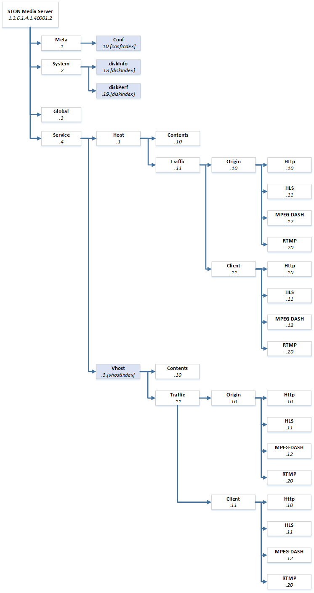

.. _snmp:

SNMP
******************

미디어 서버의 목적과 SNMP의 용도에 맞도록새롭게 구성한다. 
LIVE 채널 통계에 대해서 추가된다.

변수사용 컨셉이 다음과 같이 대폭 수정되었다. ::

   // Old
   service.vhost.contents.memory.[vhostIndex]

   // New
   service.vhost.[vhostIndex] .contents.memory

특히 다음과 같이 동시에 여러 변수를 사용하던 구조를 삭제하고 한 표현당 변수는 하나만 사용되도록 한다. ::

   // Old
   service.vhost.traffic.client.rtmp.inbound.[vhostMin].[vhostIndex]

   // New
   service.vhost.[vhostIndex].traffic.client.rtmp.inbound.0    // 실시간
   service.vhost.[vhostIndex].traffic.client.rtmp.inbound.1    // 1분 평균
   service.vhost.[vhostIndex].traffic.client.rtmp.inbound.5    // 5분 평균

기존에 제공하던 시간 평균은 실시간(.0), 1분(.1), 5분(.5) 만을 제공하며 각 항목에 별도로 명시한다.

.. toctree::
   :maxdepth: 2

.. _snmp-conf:

활성화
====================================

전역설정(server.xml)을 통해 SNMP동작방식과 ACL을 설정한다. ::

   # server.xml - <Server><Host>

   <SNMP Port="161" Status="Inactive">
      <Allow>192.168.5.1</Allow>
      <Allow>192.168.6.0/24</Allow>    
   </SNMP>   

-  ``<SNMP>`` 속성을 통해 SNMP의 동작방식을 설정한다.

   - ``Port (기본: 161)`` SNMP 서비스 포트
   
   - ``Status (기본: Inactive)`` SNMP를 활성화 하려면 이 값을 ``Active`` 로 설정한다.
   
-  ``<Allow>`` SNMP접근을 허가할 IP주소를 설정한다. 
    IP지정, IP범위지정, 비트마스크, 서브넷 이상 네 가지 형식을 지원한다. 
    접속한 소켓이 허가된 IP가 아니면 응답을 주지 않는다.
    

.. _snmp-community:

Community
====================================

Community를 설정하여 허가된 OID에만 접근/차단되도록 설정한다. ::

   # server.xml - <Server><Host>

   <SNMP UnregisteredCommunity="Allow">
      <Community Name="example1" OID="Allow">
         <OID>1.3.6.1.4.1.40001.2.4.1</OID>
         <OID>1.3.6.1.4.1.40001.2.4.2</OID>
         <OID>1.3.6.1.4.1.40001.2.4.4</OID>
      </Community>
      <Community Name="example2" OID="Deny">
         <OID>1.3.6.1.4.1.40001.2.4.3.[vhostIndex].11.11.10.1-61</OID>
      </Community>
   </SNMP>
    
``<SNMP>`` 의 ``UnregisteredCommunity`` 를 "Deny"로 설정하면 등록되지 않은 Community 요청은 차단한다.

-  ``<Community>`` Community를 설정한다.

   - ``Name`` Community 이름.
   
   - ``OID (기본: Allow)`` 하위 ``<OID>`` 태그의 값을 설정한다.
     속성 값이 ``Allow`` 라면 하위 ``<OID>`` 목록만 접근 가능하다. 
     반대로 속성 값이 ``Deny`` 라면 하위 <OID>목록에는 접근이 불가능하다.

명시적인 OID(1.3.6.1.4.1.40001.2.4.4)와 범위OID(1.3.6.1.4.1.40001.2.4.3.[vhostIndex].11.11.10.1-61) 표현이 가능하다. 
OID를 허용/차단할 경우 하위 모든 OID에 대해 같은 규칙이 적용된다.

.. _snmp-var:

변수
====================================

가상호스트나 채널처럼 설정에 따라 추가/삭제될 수 있는 값을 변수로 지칭하며 ``[...]`` 로 표기한다.

가상호스트 ``[vhostIndex]``
---------------------

가상호스트를 가리키는 고유 번호를 ``[vhostIndex]`` 로 표기한다. 
가상호스트는 10,000 단위로 증가한다. ::
   
      # vhosts.xml
   
      <Vhosts>
         <Vhost Name="www.example.com"> ... </Vhost>
         <Vhost Name="/foo"> ... </Vhost>
         <Vhost Name="www.example.com/bar"> ... </Vhost>
      </Vhosts>
   
최초 위와 같이 3개의 가상호스트가 로딩되면 10,000부터 순차적으로  ``[vhostIndex]`` 가 부여된다. 

========================== =======================
가상호스트                    vhostIndex
========================== =======================
www.example.com            10,000
/foo                       20,000
www.example.com/bar        30,000
========================== =======================

가상호스트에 ``[vhostIndex]`` 가 부여되면 해당 가상호스트가 삭제되기 전까지 변경되지 않는다.
예를 들어 /foo 가 삭제되어도 아래와 같이 ``[vhostIndex]`` 는 유지된다.

========================== =======================
가상호스트                    vhostIndex
========================== =======================
www.example.com            10,000
www.example.com/bar        30,000
========================== =======================

가상호스트의 삭제와 추가가 동시에 발생할 경우 삭제가 먼저 동작하며, 신규 추가된 가상호스트는 비어있는 ``[vhostIndex]`` 를 부여 받는다. 
가상호스트 /trip 이 추가되면 비어 있는 ``[vhostIndex]`` 인 20,000을 할당 받는다.

========================== =======================
가상호스트                    vhostIndex
========================== =======================
www.example.com            10,000
/trip                      20,000
www.example.com/bar        30,000
========================== =======================

채널 ``[vhostIndex]``
---------------------

채널도 가상호스트와 마찬가지로 ``[vhostIndex]`` 로 표기하고 동일한 통계지표를 제공한다.
하지만 가질 수 있는 값의 범위가 다음과 같이 '천(1~9,999)' 단위로 제한된다.

================== ========================== ================
분류                Name                       vhostIndex
================== ========================== ================
가상호스트            /trip                      20,000
채널                /trip/myLive_1080p         20,001
채널                /trip/myLive_720p          20,002
채널                /trip/myLive_360p          20,003
가상호스트            www.example.com/bar        30,000
================== ========================== ================

``[vhostIndex]`` 를 할당받는 정책은 가상호스트와 동일하다.
가상호스트가 삭제되면 하위에 소속된 모든 채널도 같이 삭제된다.

.. note::

   채널의 개수제한은 없지만 SNMP에서는 최대 9,999개의 채널만 수치제공이 가능하다.

                   
설정 ``[confIndex]``
---------------------

설정이 업데이트 내역을 SNMP를 통해 열람할 수 있다. ::

   # server.xml - <Server><Host>

   <SNMP ConfCount="10" />

-  ``ConfCount (기본: 10)`` 설정목록을 n개까지 열람한다.
   1~100사이에서 지정 가능하다.
   1은 현재 반영된 설정을 의미하며 2는 이전 설정을 의미한다.
   100은 현재를 기준으로 99번 이전의 설정을 의미한다.

`meta.conf`_ 를 참조한다.

                   
디스크 ``[diskIndex]``
---------------------

디스크는 자주 바뀌는 자원은 아니지만 시스템마다 다를 수 있다. 
이 경우 각 디스크를 가리키는 고유 번호가 필요하며 이를 ``[diskIndex]`` 로 표기한다.
설정된 순서대로 1부터 할당된다. ::
   
      # server.xml - <Server><Cache>
   
      <Storage>
         <Disk>/cache1</Disk>
         <Disk>/cache2</Disk>
         <Disk>/cache3</Disk>
      </Storage>
      

위와 같이 3개의 디스크가 설정된 환경에서 /cache1의 ``[diskIndex]`` 는 1, /cache3의 ``[diskIndex]`` 는 3을 가진다. 
예를 들어 /cache1의 전체용량에 해당하는 OID는 system.diskInfo.1.diskInfoTotalSize (1.3.6.1.4.1.40001.2.2.18.1.3) 이 된다. 
.1.diskInfoTotalSize 는 첫번째 디스크의 전체용량을 의미한다.
   

.. _snmp-meta:

meta
====================================

::

   OID = 1.3.6.1.4.1.40001.2.1

메타정보를 제공한다.

===== ============= ========= ===========================================
OID   Name          Type      Description
===== ============= ========= ===========================================
.1    manufacture   String    "WineSOFT Inc."
.2    software      String    "STON Media Server"
.3    version       String    버전
.4    hostname      String    호스트 이름
.5    state         String    "Healthy" 또는 "Inactive" 또는 "Emergency"
.6    uptime        Integer   실행시간 (초)
.7    admin         String    <Admin> ... </Admin>
.10   Conf          OID       설정 (확장)
===== ============= ========= ===========================================

.. _snmp-meta-conf:

meta.conf
---------------------

::

   OID = 1.3.6.1.4.1.40001.2.1.10.[confIndex]

``[confIndex]`` 는 ``<SNMP>`` 의 ``ConfCount`` 속성에서 설정한다.
``[confIndex]`` 가 1인 경우는 항상 현재 적용된 설정 값을, 
2인 경우는 이전 설정 값을 의미한다.
10 이라면 현재(1)로부터 9번째 이전의 설정을 의미한다.

==================== ======= ======= ==============================================================
OID                  Name    Type    Description
==================== ======= ======= ==============================================================
.1                   ID      Integer 설정 ID
.2                   Time    Integer 설정시간 (Unix 시간)
.3                   Type    Integer 설정형태
                                     (0: Unknown, 1: 구동, 2: reload, 3: upload, 4: restore)
.4                   Size    Integer 설정파일 크기
.5                   Hash    String  설정파일 Hash문자열
.6                   Path    String  설정파일 저장경로
.7                   Ver     String  설정할 때의 STON 미디어 서버 버전
==================== ======= ======= ==============================================================

.. _snmp-meta-system:

system
====================================

::

   OID = 1.3.6.1.4.1.40001.2.2

STON 미디어 서버가 동작하는 시스템 정보를 실시간(.0), 1분평균(.1), 5분평균(.5)으로 제공한다.

=================== ========================================= ======= ===============================================
OID                 Name                                      Type    Description
=================== ========================================= ======= ===============================================
.1                  cpuTotal                                  Integer 전체 CPU 사용률 (100%)
.2                                                                    전체 CPU 사용률 (10000%)
.3                  cpuKernel                                 Integer	CPU(Kernel) 사용률 (100%)
.4                                                                    CPU(Kernel) 사용률 (10000%)
.5                  cpuUser                                   Integer CPU(User) 사용률 (100%)
.6                                                                    CPU(User) 사용률 (10000%)
.7                  cpuIdle                                   Integer CPU(Idle) 사용률 (100%)
.8                                                                    CPU(Idle) 사용률 (10000%)
.9                  memTotal                                  Integer 시스템 전체 메모리 (KB)
.10                 memUse                                    Integer 시스템 사용 메모리 (KB)
.11                 memFree                                   Integer 시스템 여유 메모리 (KB)
.12                 memSTON                                   Integer STON 미디어 서버 사용 메모리 (KB)
.13                 memUseRatio                               Integer 시스템 메모리 사용률 (100%)
.14                                                                   시스템 메모리 사용률 (10000%)
.15                 memSTONRatio                              Integer STON 미디어 서버 메모리 사용률 (100%)
.16                                                                   STON 미디어 서버 메모리 사용률 (10000%)
.17                 diskCount                                 Integer disk개수
.18                 diskInfo                                  OID     diskInfo (확장)
.19                 diskPerf                                  OID     diskPerf (확장)
.20                 cpuProcKernel                             Integer STON 미디어 서버가 사용하는 CPU(Kernel) 사용률 (100%)
.21                                                                   STON 미디어 서버가 사용하는 CPU(Kernel) 사용률 (10000%)
.22                 cpuProcUser                               Integer STON 미디어 서버가 사용하는 CPU(User) 사용률 (100%)
.23                                                                   STON 미디어 서버가 사용하는 CPU(User) 사용률 (10000%)
.24                 sysLoadAverage                            Integer Load Average 1분 평균 (0.01)
.25                                                                   Load Average 5분 평균 (0.01)
.26                                                                   Load Average 15분 평균 (0.01)
.27                 cpuNice                                   Integer CPU(Nice) (100%)
.28                                                                   CPU(Nice) (10000%)
.29                 cpuIOWait                                 Integer CPU(IOWait) (100%)
.30                                                                   CPU(IOWait) (10000%)
.31                 cpuIRQ                                    Integer CPU(IRQ) (100%)
.32                                                                   CPU(IRQ) (10000%)
.33                 cpuSoftIRQ                                Integer CPU(SoftIRQ) (100%)
.34                                                                   CPU(SoftIRQ) (10000%)
.35                 cpuSteal                                  Integer CPU(Steal) (100%)
.36                 CPU(Steal)                                Integer (10000%)
.40                 TCPSocket.Established                     Integer Established상태의 TCP 연결개수
.41                 TCPSocket.Timewait                        Integer TIME_WAIT 상태의 TCP 연결개수
.42                 TCPSocket.Orphan                          Integer 아직 file handle에 attach되지 않은 TCP 연결
.43                 TCPSocket.Alloc                           Integer 할당된 TCP 연결
.44                 TCPSocket.Mem                             Integer undocumented
=================== ========================================= ======= ===============================================

.. _snmp-meta-system-diskinfo:
                                    
system.diskInfo
---------------------

::

   OID = 1.3.6.1.4.1.40001.2.2.18.[diskIndex]

현재 디스크 정보를 제공한다.

========= ================== =========== =========================================
OID       Name               Type        Description
========= ================== =========== =========================================
.2        diskInfoPath       String      디스크 경로                                 
.3        diskInfoTotalSize  Integer     디스크 전체용량 (MB)                    
.4        diskInfoUseSize    Integer     디스크 사용량 (MB)                          
.5        diskInfoFreeSize   Integer     디스크 사용 가능량 (MB)                 
.6        diskInfoUseRatio   Integer     디스크 사용률 (100%)                    
.7                                       디스크 사용률 (10000%)                                              
.8        diskInfoStatus     String      "Normal" 또는 "Invalid" 또는 "Unmounted"
========= ================== =========== =========================================

.. _snmp-meta-system-diskperf:
                                    
system.diskPerf
---------------------

::

   OID = 1.3.6.1.4.1.40001.2.2.19.[diskIndex]

디스크 성능상태 실시간(.0), 1분평균(.1), 5분평균(.5)으로 제공한다.

============= =========================== ========== ===============================
OID           Name                        Type       Description
============= =========================== ========== ===============================
.2            diskPerfReadCount           Integer    읽기 성공 횟수
.3            diskPerfReadMergedCount     Integer    읽기가 병합된 횟수
.4            diskPerfReadSectorsCount    Integer    읽은 섹터 수
.5            diskPerfReadTime            Integer    읽기 소요시간(ms)
.6            diskPerfWriteCount          Integer    쓰기 성공 횟수
.7            diskPerfWriteMergedCount    Integer    쓰기가 병합된 횟수
.8            diskPerfWriteSectorsCount   Integer    써진 섹터 수
.9            diskPerfWriteTime           Integer    쓰기 소요시간(ms)
.10           diskPerfIOProgressCount     Integer    진행 중인 IO개수
.11           diskPerfIOTime              Integer    IO 소요시간(ms)
.12           diskPerfIOTimeWeighted      Integer    IO 소요시간(ms, 가중치 적용)
============= =========================== ========== ===============================

.. _snmp-global:

global
====================================

::

   OID = 1.3.6.1.4.1.40001.2.3

STON 미디어 서버의 모든 모듈이 공통적으로 사용하는 자원정보(소켓, 이벤트 등)를 제공한다. 

-  **ServerSocket** - 클라이언트 ~ STON구간. STON이 클라이언트의 요청을 처리할 용도로 사용하는 소켓
-  **ClientSocket** - STON ~ 원본서버구간. STON이 원본서버로 요청을 보내는 용도로 사용하는 소켓

===== =========================================== ========== ==================================================
OID   Name                                        Type       Description
===== =========================================== ========== ==================================================
.5    EQ                                          Integer    STON Framework에서 아직 처리되지 않은 Event개수
.6    RQ                                          Integer    최근 서비스된 컨텐츠 참조 큐에 저장된 Event 개수
.7    waitingFiles2Write                          Integer    쓰기대기 중인 파일개수
.10   ServerSocket.Total                          Integer    전체 서버소켓 수
.11   ServerSocket.Established                    Integer    연결된 상태의 서버소켓 수
.12   ServerSocket.Accepted                       Integer    새롭게 연결된 서버소켓 수
.13   ServerSocket.Closed                         Integer    연결이 종료된 서버소켓 수
.20   ClientSocket.Total                          Integer    전체 클라이언트소켓 수
.21   ClientSocket.Established                    Integer    연결된 상태의 클라이언트소켓 수
.22   ClientSocket.Accepted                       Integer    새롭게 연결된 클라이언트소켓 수
.23   ClientSocket.Closed                         Integer    연결이 종료된 클라이언트소켓 수
.30   ServiceAccess.Allow                         Integer    ServiceAccess에 의해 허가(Allow)된 소켓 수
.31   ServiceAccess.Deny                          Integer    ServiceAccess에 의해 거부(Deny)된 소켓 수
===== =========================================== ========== ==================================================

.. _snmp-service:

service
====================================

::
   
    OID = 1.3.6.1.4.1.40001.2.4

서비스 통계를 가상호스트별로 상세하게 수집/제공된다.

====== ================== ========= ============================================================
OID    Name               Type      Description
====== ================== ========= ============================================================
.1     host               OID       호스트 (확장)
.2     vhostCount         Integer   가상호스트 + 채널 개수
.3     vhost              OID       가상호스트 통계 (확장)
.4     vhostOnlyCount     Integer   설정상의 가상호스트 개수
====== ================== ========= ============================================================

.. _snmp-service-host:

service.host
---------------------

::

   OID = 1.3.6.1.4.1.40001.2.4.1

호스트(=모든 가상호스트)의 정보를 제공한다.

===== ========= =========== =========================
OID   Name      Type        Description
===== ========= =========== =========================
.2    name      String      호스트 이름
.3    status    String      "Healthy" 또는 "Inactive"
.4    uptime    Integer     STON 미디어 서버 실행시간 (초)
.10   contents  OID         컨텐츠 정보 (확장)
.11   traffic   OID         통계 (확장)
===== ========= =========== =========================

.. _snmp-service-host-contents:

service.host.contents
---------------------

::

   OID = 1.3.6.1.4.1.40001.2.4.1.10

호스트(=모든 가상호스트)가 서비스하는 컨텐츠 통계를 제공한다.

====== ================ ========== ============================
OID    Name             Type       Description
====== ================ ========== ============================
.1     memory           Integer    메모리 캐싱 크기(KB)
.2     filesTotalCount  Integer    서비스 중인 파일개수
.3     filesTotalSize   Integer    서비스 중인 전체 파일량(MB)
.10    filesCountU1KB   Integer    1KB미만 파일개수
.11    filesCountU2KB   Integer    2KB미만 파일개수
.12    filesCountU4KB   Integer    4KB미만 파일개수
.13    filesCountU8KB   Integer    8KB미만 파일개수
.14    filesCountU16KB  Integer    16KB미만 파일개수
.15    filesCountU32KB  Integer    32KB미만 파일개수
.16    filesCountU64KB  Integer    64KB미만 파일개수
.17    filesCountU128KB Integer    128KB미만 파일개수
.18    filesCountU256KB Integer    256KB미만 파일개수
.19    filesCountU512KB Integer    512KB미만 파일개수
.20    filesCountU1MB   Integer    1MB미만 파일개수
.21    filesCountU2MB   Integer    2MB미만 파일개수
.22    filesCountU4MB   Integer    4MB미만 파일개수
.23    filesCountU8MB   Integer    8MB미만 파일개수
.24    filesCountU16MB  Integer    16MB미만 파일개수
.25    filesCountU32MB  Integer    32MB미만 파일개수
.26    filesCountU64MB  Integer    64MB미만 파일개수
.27    filesCountU128MB Integer    128MB미만 파일개수
.28    filesCountU256MB Integer    256MB미만 파일개수
.29    filesCountU512MB Integer    512MB미만 파일개수
.30    filesCountU1GB   Integer    1GB미만 파일개수
.31    filesCountU2GB   Integer    2GB미만 파일개수
.32    filesCountU4GB   Integer    4GB미만 파일개수
.33    filesCountU8GB   Integer    8GB미만 파일개수
.34    filesCountU16GB  Integer    16GB미만 파일개수
.35    filesCountO16GB  Integer    16GB이상 파일개수
====== ================ ========== ============================

.. _snmp-service-host-traffic:

service.host.traffic
---------------------

::

   OID = 1.3.6.1.4.1.40001.2.4.1.11

호스트(=모든 가상호스트)의 캐시 서비스와 트래픽 통계를 실시간(.0), 1분 평균(.1), 5분 평균(.5)으로 제공한다. 

===================== =============== ======= ==============================
OID                   Name            Type    Description
===================== =============== ======= ==============================
.1                    requestHitRatio Integer Request Hit Ratio(100%)
.2                                            Request Hit Ratio(10000%)
.3                    bytesHitRatio   Integer Bytes Hit Ratio(100%)
.4                                            Bytes Hit Ratio(10000%)
.10                   origin          OID     원본 트래픽 정보 (확장)
.11                   client          OID     클라이언트 트래픽 정보 (확장)
===================== =============== ======= ==============================

.. _snmp-service-host-traffic-origin:

service.host.traffic.origin
---------------------

::
   
    OID = 1.3.6.1.4.1.40001.2.4.1.11.10

종합적인 원본서버 트래픽 통계를 실시간(.0), 1분 평균(.1), 5분 평균(.5)으로 제공한다. 

========================== =================================== ========== ===================================================================
OID                        Name                                Type       Description
========================== =================================== ========== ===================================================================
.1                         inbound                             Integer    원본서버로부터 받는 평균 트래픽(Bytes)
.2                         outbound                            Integer    원본서버로 보내는 평균 트래픽(Bytes)
.3                         allSessionAverage                   Integer    전체 원본서버 평균 세션수
.4                         activeSessionAverage                Integer    전체 원본서버 세션수 중 전송 중인 평균 세션수
.10                        http                                OID        HTTP 트래픽 (확장)
.11                        hls                                 OID        HLS 트래픽 (확장)
.12                        mpegdash                            OID        MPEG-DASH 트래픽 (확장)
.20                        rtmp                                OID        RTMP 트래픽 (확장)
========================== =================================== ========== ===================================================================

.. _snmp-service-host-traffic-origin-http:

service.host.traffic.origin.http
---------------------

::
   
    OID = 1.3.6.1.4.1.40001.2.4.1.11.10.10

HTTP 원본서버 트래픽 통계를 실시간(.0), 1분 평균(.1), 5분 평균(.5)으로 제공한다. 

========================== =================================== ========== ===================================================================
OID                        Name                                Type       Description
========================== =================================== ========== ===================================================================
.1                         inbound                             Integer    원본서버로부터 받는 평균 HTTP 트래픽(Bytes)
.2                         outbound                            Integer    원본서버로 보내는 평균 HTTP 트래픽(Bytes)
.3                         allSessionAverage                   Integer    원본서버 평균 HTTP세션 수
.4                         activeSessionAverage                Integer    원본서버 평균 HTTP세션 중 전송 중인 평균 세션수
.10                        reqHeaderSize                       Integer    원본서버로 보내는 평균 HTTP Header 트래픽(Bytes)
.11                        reqBodySize                         Integer    원본서버로 보내는 평균 HTTP Body 트래픽(Bytes)
.12                        resHeaderSize                       Integer    원본서버로부터 받는 평균 HTTP Header트래픽(Bytes)
.13                        resBodySize                         Integer    원본서버로부터 받는 평균 HTTP Body트래픽(Bytes)
.14                        reqAverage                          Integer    원본서버로 보낸 평균 HTTP요청 개수
.15                        reqCount                            Integer    원본서버로 보낸 HTTP요청 개수
.20                        res2xxAverage                       Integer    원본서버가 보낸 평균 2xx응답 개수
.21                        res2xxCompleteAverage               Integer    원본서버로부터 성공한 평균 2xx 트랜잭션 개수
.22                        res2xxTimeRes                       Integer    원본서버로부터 2xx응답 헤더를 받을때까지 평균 소요시간(0.01ms)
.23                        res2xxTimeComplete                  Integer    원본서버로부터 2xx응답 HTTP 트랜잭션 평균 완료시간(0.01ms)
.24                        res2xxCount                         Integer    원본서버가 보낸 2xx응답 개수
.25                        res2xxCompleteCount                 Integer    원본서버로부터 성공한 2xx 트랜잭션 개수
.30                        res3xxAverage                       Integer    원본서버가 보낸 평균 3xx응답 개수
.31                        res3xxCompleteAverage               Integer    원본서버로부터 성공한 평균 3xx 트랜잭션 개수
.32                        res3xxTimeRes                       Integer    원본서버로부터 3xx응답 헤더를 받을때까지 평균 소요시간(0.01ms)
.33                        res3xxTimeComplete                  Integer    원본서버로부터 3xx응답 HTTP 트랜잭션 평균 완료시간(0.01ms)
.34                        res3xxCount                         Integer    원본서버가 보낸 3xx응답 개수
.35                        res3xxCompleteCount                 Integer    원본서버로부터 성공한 3xx 트랜잭션 개수
.40                        res4xxAverage                       Integer    원본서버가 보낸 평균 4xx응답 개수
.41                        res4xxCompleteAverage               Integer    원본서버로부터 성공한 평균 4xx 트랜잭션 개수
.42                        res4xxTimeRes                       Integer    원본서버로부터 4xx응답 헤더를 받을때까지 평균 소요시간(0.01ms)
.43                        res4xxTimeComplete                  Integer    원본서버로부터 4xx응답 HTTP 트랜잭션 평균 완료시간(0.01ms)
.44                        res4xxCount                         Integer    원본서버가 보낸 4xx응답 개수
.45                        res4xxCompleteCount                 Integer    원본서버로부터 성공한 4xx 트랜잭션 개수
.50                        res5xxAverage                       Integer    원본서버가 보낸 평균 5xx응답 개수
.51                        res5xxCompleteAverage               Integer    원본서버로부터 성공한 평균 5xx 트랜잭션 개수
.52                        res5xxTimeRes                       Integer    원본서버로부터 5xx응답 헤더를 받을때까지 평균 소요시간(0.01ms)
.53                        res5xxTimeComplete                  Integer    원본서버로부터 5xx응답 HTTP 트랜잭션 평균 완료시간(0.01ms)
.54                        res5xxCount                         Integer    원본서버가 보낸 5xx응답 개수
.55                        res5xxCompleteCount                 Integer    원본서버로부터 성공한 5xx 트랜잭션 개수
.80                        resTotalAverage                     Integer    원본서버가 보낸 전체 평균 HTTP응답 개수
.81                        resTotalCompleteAverage             Integer    원본서버로부터 성공한 평균 HTTP트랜잭션 개수
.82                        resTotalTimeRes                     Integer    원본서버로부터 응답 헤더를 받을때까지 평균 소요시간(0.01ms)
.83                        resTotalTimeComplete                Integer    원본서버로부터 응답 HTTP 트랜잭션 평균 완료시간(0.01ms)
.84                        resTotalCount                       Integer    원본서버가 보낸 전체 HTTP응답 개수
.85                        resTotalCompleteCount               Integer    원본서버로부터 성공한 HTTP트랜잭션 개수
.90                        connectTimeoutAverage               Integer    평균 원본서버 접속실패 횟수
.91                        receiveTimeoutAverage               Integer    평균 원본서버 전송실패 횟수
.92                        connectAverage                      Integer    평균 원본서버 접속성공 횟수
.93                        dnsQueryTime                        Integer    원본서버 접속 시 평균 DNS쿼리 소요시간
.94                        connectTime                         Integer    원본서버 평균 접속 소요시간(0.01ms)
.95                        connectTimeoutCount                 Integer    원본서버 접속실패 횟수
.96                        receiveTimeoutCount                 Integer    원본서버 전송실패 횟수
.97                        connectCount                        Integer    원본서버 접속성공 횟수
.98                        closeAverage                        Integer    전송 중 원본서버에서 먼저 소켓을 종료한 평균 횟수
.99                        closeCount                          Integer    전송 중 원본서버에서 먼저 소켓을 종료한 횟수
========================== =================================== ========== ===================================================================
                           
                           
                           
.. _snmp-service-host-traffic-origin-hls:

service.host.traffic.origin.hls
---------------------

::
   
    OID = 1.3.6.1.4.1.40001.2.4.1.11.10.11

HLS 원본서버 트래픽 통계를 실시간(.0), 1분 평균(.1), 5분 평균(.5)으로 제공한다. 

========================== =================================== ========== ===================================================================
OID                        Name                                Type       Description
========================== =================================== ========== ===================================================================
.1                         inbound                             Integer    원본서버로부터 받는 평균 HLS 트래픽(Bytes)
.2                         outbound                            Integer    원본서버로 보내는 평균 HLS 트래픽(Bytes)
.3                         allSessionAverage                   Integer    원본서버 평균 HLS세션 수
.4                         activeSessionAverage                Integer    원본서버 평균 HLS세션 중 전송 중인 평균 세션수
.10                        reqHeaderSize                       Integer    원본서버로 보내는 평균 HLS Header 트래픽(Bytes)
.11                        reqBodySize                         Integer    원본서버로 보내는 평균 HLS Body 트래픽(Bytes)
.12                        resHeaderSize                       Integer    원본서버로부터 받는 평균 HLS Header트래픽(Bytes)
.13                        resBodySize                         Integer    원본서버로부터 받는 평균 HLS Body트래픽(Bytes)
.14                        reqAverage                          Integer    원본서버로 보낸 평균 HLS요청 개수
.15                        reqCount                            Integer    원본서버로 보낸 HLS요청 개수
.20                        res2xxAverage                       Integer    원본서버가 보낸 평균 2xx응답 개수
.21                        res2xxCompleteAverage               Integer    원본서버로부터 성공한 평균 2xx 트랜잭션 개수
.22                        res2xxTimeRes                       Integer    원본서버로부터 2xx응답 헤더를 받을때까지 평균 소요시간(0.01ms)
.23                        res2xxTimeComplete                  Integer    원본서버로부터 2xx응답 HLS 트랜잭션 평균 완료시간(0.01ms)
.24                        res2xxCount                         Integer    원본서버가 보낸 2xx응답 개수
.25                        res2xxCompleteCount                 Integer    원본서버로부터 성공한 2xx 트랜잭션 개수
.30                        res3xxAverage                       Integer    원본서버가 보낸 평균 3xx응답 개수
.31                        res3xxCompleteAverage               Integer    원본서버로부터 성공한 평균 3xx 트랜잭션 개수
.32                        res3xxTimeRes                       Integer    원본서버로부터 3xx응답 헤더를 받을때까지 평균 소요시간(0.01ms)
.33                        res3xxTimeComplete                  Integer    원본서버로부터 3xx응답 HLS 트랜잭션 평균 완료시간(0.01ms)
.34                        res3xxCount                         Integer    원본서버가 보낸 3xx응답 개수
.35                        res3xxCompleteCount                 Integer    원본서버로부터 성공한 3xx 트랜잭션 개수
.40                        res4xxAverage                       Integer    원본서버가 보낸 평균 4xx응답 개수
.41                        res4xxCompleteAverage               Integer    원본서버로부터 성공한 평균 4xx 트랜잭션 개수
.42                        res4xxTimeRes                       Integer    원본서버로부터 4xx응답 헤더를 받을때까지 평균 소요시간(0.01ms)
.43                        res4xxTimeComplete                  Integer    원본서버로부터 4xx응답 HLS 트랜잭션 평균 완료시간(0.01ms)
.44                        res4xxCount                         Integer    원본서버가 보낸 4xx응답 개수
.45                        res4xxCompleteCount                 Integer    원본서버로부터 성공한 4xx 트랜잭션 개수
.50                        res5xxAverage                       Integer    원본서버가 보낸 평균 5xx응답 개수
.51                        res5xxCompleteAverage               Integer    원본서버로부터 성공한 평균 5xx 트랜잭션 개수
.52                        res5xxTimeRes                       Integer    원본서버로부터 5xx응답 헤더를 받을때까지 평균 소요시간(0.01ms)
.53                        res5xxTimeComplete                  Integer    원본서버로부터 5xx응답 HLS 트랜잭션 평균 완료시간(0.01ms)
.54                        res5xxCount                         Integer    원본서버가 보낸 5xx응답 개수
.55                        res5xxCompleteCount                 Integer    원본서버로부터 성공한 5xx 트랜잭션 개수
.80                        resTotalAverage                     Integer    원본서버가 보낸 전체 평균 HLS응답 개수
.81                        resTotalCompleteAverage             Integer    원본서버로부터 성공한 평균 HLS트랜잭션 개수
.82                        resTotalTimeRes                     Integer    원본서버로부터 응답 헤더를 받을때까지 평균 소요시간(0.01ms)
.83                        resTotalTimeComplete                Integer    원본서버로부터 응답 HLS 트랜잭션 평균 완료시간(0.01ms)
.84                        resTotalCount                       Integer    원본서버가 보낸 전체 HLS응답 개수
.85                        resTotalCompleteCount               Integer    원본서버로부터 성공한 HLS트랜잭션 개수
.90                        connectTimeoutAverage               Integer    평균 원본서버 접속실패 횟수
.91                        receiveTimeoutAverage               Integer    평균 원본서버 전송실패 횟수
.92                        connectAverage                      Integer    평균 원본서버 접속성공 횟수
.93                        dnsQueryTime                        Integer    원본서버 접속 시 평균 DNS쿼리 소요시간
.94                        connectTime                         Integer    원본서버 평균 접속 소요시간(0.01ms)
.95                        connectTimeoutCount                 Integer    원본서버 접속실패 횟수
.96                        receiveTimeoutCount                 Integer    원본서버 전송실패 횟수
.97                        connectCount                        Integer    원본서버 접속성공 횟수
.98                        closeAverage                        Integer    전송 중 원본서버에서 먼저 소켓을 종료한 평균 횟수
.99                        closeCount                          Integer    전송 중 원본서버에서 먼저 소켓을 종료한 횟수
========================== =================================== ========== ===================================================================

.. _snmp-service-host-traffic-origin-mpegdash:

service.host.traffic.origin.mpegdash
---------------------

::
   
    OID = 1.3.6.1.4.1.40001.2.4.1.11.10.12

MPEG-DASH 원본서버 트래픽 통계를 실시간(.0), 1분 평균(.1), 5분 평균(.5)으로 제공한다. 

========================== =================================== ========== ===================================================================
OID                        Name                                Type       Description
========================== =================================== ========== ===================================================================
.1                         inbound                             Integer    원본서버로부터 받는 평균 MPEG-DASH 트래픽(Bytes)
.2                         outbound                            Integer    원본서버로 보내는 평균 MPEG-DASH 트래픽(Bytes)
.3                         allSessionAverage                   Integer    원본서버 평균 MPEG-DASH세션 수
.4                         activeSessionAverage                Integer    원본서버 평균 MPEG-DASH세션 중 전송 중인 평균 세션수
.10                        reqHeaderSize                       Integer    원본서버로 보내는 평균 MPEG-DASH Header 트래픽(Bytes)
.11                        reqBodySize                         Integer    원본서버로 보내는 평균 MPEG-DASH Body 트래픽(Bytes)
.12                        resHeaderSize                       Integer    원본서버로부터 받는 평균 MPEG-DASH Header트래픽(Bytes)
.13                        resBodySize                         Integer    원본서버로부터 받는 평균 MPEG-DASH Body트래픽(Bytes)
.14                        reqAverage                          Integer    원본서버로 보낸 평균 MPEG-DASH요청 개수
.15                        reqCount                            Integer    원본서버로 보낸 MPEG-DASH요청 개수
.20                        res2xxAverage                       Integer    원본서버가 보낸 평균 2xx응답 개수
.21                        res2xxCompleteAverage               Integer    원본서버로부터 성공한 평균 2xx 트랜잭션 개수
.22                        res2xxTimeRes                       Integer    원본서버로부터 2xx응답 헤더를 받을때까지 평균 소요시간(0.01ms)
.23                        res2xxTimeComplete                  Integer    원본서버로부터 2xx응답 MPEG-DASH 트랜잭션 평균 완료시간(0.01ms)
.24                        res2xxCount                         Integer    원본서버가 보낸 2xx응답 개수
.25                        res2xxCompleteCount                 Integer    원본서버로부터 성공한 2xx 트랜잭션 개수
.30                        res3xxAverage                       Integer    원본서버가 보낸 평균 3xx응답 개수
.31                        res3xxCompleteAverage               Integer    원본서버로부터 성공한 평균 3xx 트랜잭션 개수
.32                        res3xxTimeRes                       Integer    원본서버로부터 3xx응답 헤더를 받을때까지 평균 소요시간(0.01ms)
.33                        res3xxTimeComplete                  Integer    원본서버로부터 3xx응답 MPEG-DASH 트랜잭션 평균 완료시간(0.01ms)
.34                        res3xxCount                         Integer    원본서버가 보낸 3xx응답 개수
.35                        res3xxCompleteCount                 Integer    원본서버로부터 성공한 3xx 트랜잭션 개수
.40                        res4xxAverage                       Integer    원본서버가 보낸 평균 4xx응답 개수
.41                        res4xxCompleteAverage               Integer    원본서버로부터 성공한 평균 4xx 트랜잭션 개수
.42                        res4xxTimeRes                       Integer    원본서버로부터 4xx응답 헤더를 받을때까지 평균 소요시간(0.01ms)
.43                        res4xxTimeComplete                  Integer    원본서버로부터 4xx응답 MPEG-DASH 트랜잭션 평균 완료시간(0.01ms)
.44                        res4xxCount                         Integer    원본서버가 보낸 4xx응답 개수
.45                        res4xxCompleteCount                 Integer    원본서버로부터 성공한 4xx 트랜잭션 개수
.50                        res5xxAverage                       Integer    원본서버가 보낸 평균 5xx응답 개수
.51                        res5xxCompleteAverage               Integer    원본서버로부터 성공한 평균 5xx 트랜잭션 개수
.52                        res5xxTimeRes                       Integer    원본서버로부터 5xx응답 헤더를 받을때까지 평균 소요시간(0.01ms)
.53                        res5xxTimeComplete                  Integer    원본서버로부터 5xx응답 MPEG-DASH 트랜잭션 평균 완료시간(0.01ms)
.54                        res5xxCount                         Integer    원본서버가 보낸 5xx응답 개수
.55                        res5xxCompleteCount                 Integer    원본서버로부터 성공한 5xx 트랜잭션 개수
.80                        resTotalAverage                     Integer    원본서버가 보낸 전체 평균 MPEG-DASH응답 개수
.81                        resTotalCompleteAverage             Integer    원본서버로부터 성공한 평균 MPEG-DASH트랜잭션 개수
.82                        resTotalTimeRes                     Integer    원본서버로부터 응답 헤더를 받을때까지 평균 소요시간(0.01ms)
.83                        resTotalTimeComplete                Integer    원본서버로부터 응답 MPEG-DASH 트랜잭션 평균 완료시간(0.01ms)
.84                        resTotalCount                       Integer    원본서버가 보낸 전체 MPEG-DASH응답 개수
.85                        resTotalCompleteCount               Integer    원본서버로부터 성공한 MPEG-DASH트랜잭션 개수
.90                        connectTimeoutAverage               Integer    평균 원본서버 접속실패 횟수
.91                        receiveTimeoutAverage               Integer    평균 원본서버 전송실패 횟수
.92                        connectAverage                      Integer    평균 원본서버 접속성공 횟수
.93                        dnsQueryTime                        Integer    원본서버 접속 시 평균 DNS쿼리 소요시간
.94                        connectTime                         Integer    원본서버 평균 접속 소요시간(0.01ms)
.95                        connectTimeoutCount                 Integer    원본서버 접속실패 횟수
.96                        receiveTimeoutCount                 Integer    원본서버 전송실패 횟수
.97                        connectCount                        Integer    원본서버 접속성공 횟수
.98                        closeAverage                        Integer    전송 중 원본서버에서 먼저 소켓을 종료한 평균 횟수
.99                        closeCount                          Integer    전송 중 원본서버에서 먼저 소켓을 종료한 횟수
========================== =================================== ========== ===================================================================

.. _snmp-service-host-traffic-origin-rtmp:

service.host.traffic.origin.rtmp
---------------------

::
   
    OID = 1.3.6.1.4.1.40001.2.4.1.11.10.20

RTMP 원본서버 트래픽 통계를 실시간(.0), 1분 평균(.1), 5분 평균(.5)으로 제공한다.

.. warning::

   우선 클라이언트 RTMP와 동일하게 명시하였다. 
   Push에 필요한 통계로 재정비해야 한다.

============================================= ============================================= ========== =============================================================
OID                                           Name                                          Type       Description                                                  
============================================= ============================================= ========== =============================================================
.1                                            inbound                                       Integer    원본서버로부터 받는 평균 트래픽(Bytes)
.2                                            outbound                                      Integer    원본서버로 보내는 평균 트래픽(Bytes)
.3                                            allSessionAverage                             Integer    원본서버 평균 세션수
.4                                            activeSessionAverage                          Integer    원본서버 중 전송 중인 평균 세션수
.10                                           reqHeaderSize                                 Integer    원본서버로부터 받는 평균 Header 트래픽(Bytes)
.11                                           reqBodySize                                   Integer    원본서버로부터 받는 평균 Body 트래픽(Bytes)
.12                                           resHeaderSize                                 Integer    원본서버로 보내는 평균 Header트래픽(Bytes)
.13                                           resBodySize                                   Integer    원본서버로 보내는 평균 Body트래픽(Bytes)
.14                                           reqAverage                                    Integer    원본서버로부터 받은 평균요청 개수
.15                                           reqCount                                      Integer    원본서버로부터 받은 누적요청 개수
.20                                           NetConnection.Connect                         Integer    NetConnection.Connect 응답통계
.20.1                                         NetConnection.Connect.SuccessAverage          Integer    성공응답 평균개수 (평균)
.20.2                                         NetConnection.Connect.SuccessCount            Integer    성공응답 평균개수
.20.3                                         NetConnection.Connect.FailAverage             Integer    실패응답 평균개수 (평균)
.20.4                                         NetConnection.Connect.FailCount               Integer    실패응답 평균개수
.20.5                                         NetConnection.Connect.TimeRes                 Integer    응답 평균 소요시간(0.01ms)
.21                                           NetConnection.CreateStream                    Integer    NetConnection.CreateStream 응답통계
.21.1                                         NetConnection.CreateStream.SuccessAverage     Integer    성공응답 평균개수 (평균)
.21.2                                         NetConnection.CreateStream.SuccessCount       Integer    성공응답 평균개수
.21.3                                         NetConnection.CreateStream.FailAverage        Integer    실패응답 평균개수 (평균)
.21.4                                         NetConnection.CreateStream.FailCount          Integer    실패응답 평균개수
.21.5                                         NetConnection.CreateStream.TimeRes            Integer    응답 평균 소요시간(0.01ms)
.30                                           NetStream.Play                                Integer    NetStream.Play 응답통계
.30.1                                         NetStream.Play.SuccessAverage                 Integer    성공응답 평균개수 (평균)
.30.2                                         NetStream.Play.SuccessCount                   Integer    성공응답 평균개수
.30.3                                         NetStream.Play.FailAverage                    Integer    실패응답 평균개수 (평균)
.30.4                                         NetStream.Play.FailCount                      Integer    실패응답 평균개수
.30.5                                         NetStream.Play.TimeRes                        Integer    응답 평균 소요시간(0.01ms)
.31                                           NetStream.Close                               Integer    NetStream.Close 응답통계
.31.1                                         NetStream.Close.SuccessAverage                Integer    성공응답 평균개수 (평균)
.31.2                                         NetStream.Close.SuccessCount                  Integer    성공응답 평균개수
.31.3                                         NetStream.Close.FailAverage                   Integer    실패응답 평균개수 (평균)
.31.4                                         NetStream.Close.FailCount                     Integer    실패응답 평균개수
.31.5                                         NetStream.Close.TimeRes                       Integer    응답 평균 소요시간(0.01ms)
.32                                           NetStream.Delete                              Integer    NetStream.Delete 응답통계
.32.1                                         NetStream.Delete.SuccessAverage               Integer    성공응답 평균개수 (평균)
.32.2                                         NetStream.Delete.SuccessCount                 Integer    성공응답 평균개수
.32.3                                         NetStream.Delete.FailAverage                  Integer    실패응답 평균개수 (평균)
.32.4                                         NetStream.Delete.FailCount                    Integer    실패응답 평균개수
.32.5                                         NetStream.Delete.TimeRes                      Integer    응답 평균 소요시간(0.01ms)
.33                                           NetStream.Seek                                Integer    NetStream.Seek 응답통계
.33.1                                         NetStream.Seek.SuccessAverage                 Integer    성공응답 평균개수 (평균)
.33.2                                         NetStream.Seek.SuccessCount                   Integer    성공응답 평균개수
.33.3                                         NetStream.Seek.FailAverage                    Integer    실패응답 평균개수 (평균)
.33.4                                         NetStream.Seek.FailCount                      Integer    실패응답 평균개수
.33.5                                         NetStream.Seek.TimeRes                        Integer    응답 평균 소요시간(0.01ms)
.34                                           NetStream.Pause                               Integer    NetStream.Pause 응답통계
.34.1                                         NetStream.Pause.SuccessAverage                Integer    성공응답 개수 (평균)
.34.2                                         NetStream.Pause.SuccessCount                  Integer    성공응답 개수
.34.3                                         NetStream.Pause.FailAverage                   Integer    실패응답 개수 (평균)
.34.4                                         NetStream.Pause.FailCount                     Integer    실패응답 개수
.34.5                                         NetStream.Pause.TimeRes                       Integer    응답 평균 소요시간(0.01ms)
============================================= ============================================= ========== =============================================================
                           

                           
.. _snmp-service-host-traffic-client:

service.host.traffic.client
---------------------

::

   OID = 1.3.6.1.4.1.40001.2.4.1.11.11

종합적인 클라이언트 트래픽 통계를 실시간(.0), 1분 평균(.1), 5분 평균(.5)으로 제공한다.

========================== ========================================== ========== =============================================================
OID                        Name                                       Type       Description
========================== ========================================== ========== =============================================================
.1                         inbound                                    Integer    클라이언트로부터 받는 평균 트래픽(Bytes)
.2                         outbound                                   Integer    클라이언트로 보내는 평균 트래픽(Bytes)
.3                         allSessionAverage                          Integer    전체 클라이언트 평균 세션수
.4                         activeSessionAverage                       Integer    전체 클라이언트 중 전송 중인 평균 세션수
.5                         requestHitAverage                          OID        전체 평균 캐시 HIT결과
.5.1                       requestHitAverage.TCP_HIT                  Integer    TCP_HIT
.5.2                       requestHitAverage.TCP_IMS_HIT              Integer    TCP_IMS_HIT
.5.3                       requestHitAverage.TCP_REFRESH_HIT          Integer    TCP_REFRESH_HIT
.5.4                       requestHitAverage.TCP_REF_FAIL_HIT         Integer    TCP_REF_FAIL_HIT
.5.5                       requestHitAverage.TCP_NEGATIVE_HIT         Integer    TCP_NEGATIVE_HIT
.5.6                       requestHitAverage.TCP_MISS                 Integer    TCP_MISS
.5.7                       requestHitAverage.TCP_REFRESH_MISS         Integer    TCP_REFRESH_MISS
.5.8                       requestHitAverage.TCP_CLIENT_REFRESH_MISS  Integer    TCP_CLIENT_REFRESH_MISS
.5.9                       requestHitAverage.TCP_DENIED               Integer    TCP_DENIED
.5.10                      requestHitAverage.TCP_ERROR                Integer    TCP_ERROR
.5.11                      requestHitAverage.TCP_REDIRECT_HIT         Integer    TCP_REDIRECT_HIT
.6                         requestHitCount                            OID        캐시 HIT결과 개수
.6.1                       requestHitCount.TCP_HIT                    Integer    TCP_HIT
.6.2                       requestHitCount.TCP_IMS_HIT                Integer    TCP_IMS_HIT
.6.3                       requestHitCount.TCP_REFRESH_HIT            Integer    TCP_REFRESH_HIT
.6.4                       requestHitCount.TCP_REF_FAIL_HIT           Integer    TCP_REF_FAIL_HIT
.6.5                       requestHitCount.TCP_NEGATIVE_HIT           Integer    TCP_NEGATIVE_HIT
.6.6                       requestHitCount.TCP_MISS                   Integer    TCP_MISS
.6.7                       requestHitCount.TCP_REFRESH_MISS           Integer    TCP_REFRESH_MISS
.6.8                       requestHitCount.TCP_CLIENT_REFRESH_MISS    Integer    TCP_CLIENT_REFRESH_MISS
.6.9                       requestHitCount.TCP_DENIED                 Integer    TCP_DENIED
.6.10                      requestHitCount.TCP_ERROR                  Integer    TCP_ERROR
.6.11                      requestHitCount.TCP_REDIRECT_HIT           Integer    TCP_REDIRECT_HIT
.10                        http                                       OID        HTTP 트래픽 (확장)
.11                        hls                                        OID        HLS 트래픽 (확장)
.12                        mpegdash                                   OID        MPEG-DASH 트래픽 (확장)
.20                        rtmp                                       OID        RTMP 트래픽 (확장)
========================== ========================================== ========== =============================================================

.. _snmp-service-host-traffic-client-http:                                                                                                           
                                                                                                                                              
service.host.traffic.client.http                                                                                                                 
---------------------                                                                                                                         
                                                                                                                                              
::                                                                                                                                            
                                                                                                                                              
   OID = 1.3.6.1.4.1.40001.2.4.1.11.11.10
                                                                                                                                              
HTTP 클라이언트 트래픽 통계를 실시간(.0), 1분 평균(.1), 5분 평균(.5)으로 제공한다.                                                                                                                      
                                                                                                                                              
========================== ========================================== ========== =============================================================
OID                        Name                                       Type       Description                                                  
========================== ========================================== ========== =============================================================
.1                         inbound                                    Integer    클라이언트로부터 받는 평균 트래픽(Bytes)
.2                         outbound                                   Integer    클라이언트로 보내는 평균 트래픽(Bytes)
.3                         allSessionAverage                          Integer    클라이언트 평균 세션수
.4                         activeSessionAverage                       Integer    클라이언트 중 전송 중인 평균 세션수
.5                         requestHitRatio                            Integer    Request Hit Ratio(100%)
.6                                                                               Request Hit Ratio(10000%)
.7                         requestHitAverage                          OID        평균 캐시 HIT결과
.7.1                       requestHitAverage.TCP_HIT                  Integer    TCP_HIT
.7.2                       requestHitAverage.TCP_IMS_HIT              Integer    TCP_IMS_HIT
.7.3                       requestHitAverage.TCP_REFRESH_HIT          Integer    TCP_REFRESH_HIT
.7.4                       requestHitAverage.TCP_REF_FAIL_HIT         Integer    TCP_REF_FAIL_HIT
.7.5                       requestHitAverage.TCP_NEGATIVE_HIT         Integer    TCP_NEGATIVE_HIT
.7.6                       requestHitAverage.TCP_MISS                 Integer    TCP_MISS
.7.7                       requestHitAverage.TCP_REFRESH_MISS         Integer    TCP_REFRESH_MISS
.7.8                       requestHitAverage.TCP_CLIENT_REFRESH_MISS  Integer    TCP_CLIENT_REFRESH_MISS
.7.9                       requestHitAverage.TCP_DENIED               Integer    TCP_DENIED
.7.10                      requestHitAverage.TCP_ERROR                Integer    TCP_ERROR
.7.11                      requestHitAverage.TCP_REDIRECT_HIT         Integer    TCP_REDIRECT_HIT
.8                         requestHitCount                            OID        캐시 HIT결과 개수
.8.1                       requestHitCount.TCP_HIT                    Integer    TCP_HIT
.8.2                       requestHitCount.TCP_IMS_HIT                Integer    TCP_IMS_HIT
.8.3                       requestHitCount.TCP_REFRESH_HIT            Integer    TCP_REFRESH_HIT
.8.4                       requestHitCount.TCP_REF_FAIL_HIT           Integer    TCP_REF_FAIL_HIT
.8.5                       requestHitCount.TCP_NEGATIVE_HIT           Integer    TCP_NEGATIVE_HIT
.8.6                       requestHitCount.TCP_MISS                   Integer    TCP_MISS
.8.7                       requestHitCount.TCP_REFRESH_MISS           Integer    TCP_REFRESH_MISS
.8.8                       requestHitCount.TCP_CLIENT_REFRESH_MISS    Integer    TCP_CLIENT_REFRESH_MISS
.8.9                       requestHitCount.TCP_DENIED                 Integer    TCP_DENIED
.8.10                      requestHitCount.TCP_ERROR                  Integer    TCP_ERROR
.8.11                      requestHitCount.TCP_REDIRECT_HIT           Integer    TCP_REDIRECT_HIT
.10                        reqHeaderSize                              Integer    클라이언트로부터 받는 평균 Header 트래픽(Bytes)
.11                        reqBodySize                                Integer    클라이언트로부터 받는 평균 Body 트래픽(Bytes)
.12                        resHeaderSize                              Integer    클라이언트로 보내는 평균 Header트래픽(Bytes)
.13                        resBodySize                                Integer    클라이언트로 보내는 평균 Body트래픽(Bytes)
.14                        reqAverage                                 Integer    클라이언트로부터 받은 평균요청 개수
.15                        reqCount                                   Integer    클라이언트로부터 받은 누적요청 개수
.20                        res2xxAverage                              Integer    클라이언트로 보낸 평균 2xx응답 개수
.21                        res2xxCompleteAverage                      Integer    클라이언트가 완료한 평균 2xx트랜잭션 개수
.22                        res2xxTimeRes                              Integer    클라이언트 2xx응답 평균 소요시간(0.01ms)
.23                        res2xxTimeComplete                         Integer    클라이언트 2xx응답 트랜잭션 평균 완료시간(0.01ms)
.24                        res2xxCount                                Integer    클라이언트로 보낸 2xx응답 개수
.25                        res2xxCompleteCount                        Integer    클라이언트가 완료한 2xx트랜잭션 개수
.30                        res3xxAverage                              Integer    클라이언트로 보낸 평균 3xx응답 개수
.31                        res3xxCompleteAverage                      Integer    클라이언트가 완료한 평균 3xx트랜잭션 개수
.32                        res3xxTimeRes                              Integer    클라이언트 3xx응답 평균 소요시간(0.01ms)
.33                        res3xxTimeComplete                         Integer    클라이언트 3xx응답 트랜잭션 평균 완료시간(0.01ms)
.34                        res3xxCount                                Integer    클라이언트로 보낸 3xx응답 개수
.35                        res3xxCompleteCount                        Integer    클라이언트가 완료한 3xx트랜잭션 개수
.40                        res4xxAverage                              Integer    클라이언트로 보낸 평균 4xx응답 개수
.41                        res4xxCompleteAverage                      Integer    클라이언트가 완료한 평균 4xx트랜잭션 개수
.42                        res4xxTimeRes                              Integer    클라이언트 4xx응답 평균 소요시간(0.01ms)
.43                        res4xxTimeComplete                         Integer    클라이언트 4xx응답 트랜잭션 평균 완료시간(0.01ms)
.44                        res4xxCount                                Integer    클라이언트로 보낸 4xx응답 개수
.45                        res4xxCompleteCount                        Integer    클라이언트가 완료한 4xx트랜잭션 개수
.50                        res5xxAverage                              Integer    클라이언트로 보낸 평균 5xx응답 개수
.51                        res5xxCompleteAverage                      Integer    클라이언트가 완료한 평균 5xx트랜잭션 개수
.52                        res5xxTimeRes                              Integer    클라이언트 5xx응답 평균 소요시간(0.01ms)
.53                        res5xxTimeComplete                         Integer    클라이언트 5xx응답 트랜잭션 평균 완료시간(0.01ms)
.54                        res5xxCount                                Integer    클라이언트로 보낸 5xx응답 개수
.55                        res5xxCompleteCount                        Integer    클라이언트가 완료한 5xx트랜잭션 개수
.80                        resTotalAverage                            Integer    클라이언트로 보낸 평균 전체응답 개수
.81                        resTotalCompleteAverage                    Integer    클라이언트가 완료한 평균 트랜잭션 개수
.82                        resTotalTimeRes                            Integer    클라이언트 응답 평균 소요시간(0.01ms)
.83                        resTotalTimeComplete                       Integer    클라이언트 트랜잭션 평균 완료시간(0.01ms)
.84                        resTotalCount                              Integer    클라이언트로 보낸 전체응답 개수
.85                        resTotalCompleteCount                      Integer    클라이언트가 완료한 트랜잭션 개수
========================== ========================================== ========== =============================================================

.. _snmp-service-host-traffic-client-hls:                                                                                                           
                                                                                                                                              
service.host.traffic.client.hls                                                                                                     
---------------------                                                                                                                         
                                                                                                                                              
::                                                                                                                                            
                                                                                                                                              
   OID = 1.3.6.1.4.1.40001.2.4.1.11.11.11
                                                                                                                                              
HLS 클라이언트 트래픽 통계를 실시간(.0), 1분 평균(.1), 5분 평균(.5)으로 제공한다. 

========================== ========================================== ========== =============================================================
OID                        Name                                       Type       Description                                                  
========================== ========================================== ========== =============================================================
.1                         inbound                                    Integer    클라이언트로부터 받는 평균 트래픽(Bytes)
.2                         outbound                                   Integer    클라이언트로 보내는 평균 트래픽(Bytes)
.3                         allSessionAverage                          Integer    클라이언트 평균 세션수
.4                         activeSessionAverage                       Integer    클라이언트 중 전송 중인 평균 세션수
.5                         requestHitRatio                            Integer    Request Hit Ratio(100%)
.6                                                                               Request Hit Ratio(10000%)
.7                         requestHitAverage                          OID        평균 캐시 HIT결과
.7.1                       requestHitAverage.TCP_HIT                  Integer    TCP_HIT
.7.2                       requestHitAverage.TCP_IMS_HIT              Integer    TCP_IMS_HIT
.7.3                       requestHitAverage.TCP_REFRESH_HIT          Integer    TCP_REFRESH_HIT
.7.4                       requestHitAverage.TCP_REF_FAIL_HIT         Integer    TCP_REF_FAIL_HIT
.7.5                       requestHitAverage.TCP_NEGATIVE_HIT         Integer    TCP_NEGATIVE_HIT
.7.6                       requestHitAverage.TCP_MISS                 Integer    TCP_MISS
.7.7                       requestHitAverage.TCP_REFRESH_MISS         Integer    TCP_REFRESH_MISS
.7.8                       requestHitAverage.TCP_CLIENT_REFRESH_MISS  Integer    TCP_CLIENT_REFRESH_MISS
.7.9                       requestHitAverage.TCP_DENIED               Integer    TCP_DENIED
.7.10                      requestHitAverage.TCP_ERROR                Integer    TCP_ERROR
.7.11                      requestHitAverage.TCP_REDIRECT_HIT         Integer    TCP_REDIRECT_HIT
.8                         requestHitCount                            OID        캐시 HIT결과 개수
.8.1                       requestHitCount.TCP_HIT                    Integer    TCP_HIT
.8.2                       requestHitCount.TCP_IMS_HIT                Integer    TCP_IMS_HIT
.8.3                       requestHitCount.TCP_REFRESH_HIT            Integer    TCP_REFRESH_HIT
.8.4                       requestHitCount.TCP_REF_FAIL_HIT           Integer    TCP_REF_FAIL_HIT
.8.5                       requestHitCount.TCP_NEGATIVE_HIT           Integer    TCP_NEGATIVE_HIT
.8.6                       requestHitCount.TCP_MISS                   Integer    TCP_MISS
.8.7                       requestHitCount.TCP_REFRESH_MISS           Integer    TCP_REFRESH_MISS
.8.8                       requestHitCount.TCP_CLIENT_REFRESH_MISS    Integer    TCP_CLIENT_REFRESH_MISS
.8.9                       requestHitCount.TCP_DENIED                 Integer    TCP_DENIED
.8.10                      requestHitCount.TCP_ERROR                  Integer    TCP_ERROR
.8.11                      requestHitCount.TCP_REDIRECT_HIT           Integer    TCP_REDIRECT_HIT
.10                        reqHeaderSize                              Integer    클라이언트로부터 받는 평균 Header 트래픽(Bytes)
.11                        reqBodySize                                Integer    클라이언트로부터 받는 평균 Body 트래픽(Bytes)
.12                        resHeaderSize                              Integer    클라이언트로 보내는 평균 Header트래픽(Bytes)
.13                        resBodySize                                Integer    클라이언트로 보내는 평균 Body트래픽(Bytes)
.14                        reqAverage                                 Integer    클라이언트로부터 받은 평균요청 개수
.15                        reqCount                                   Integer    클라이언트로부터 받은 누적요청 개수
.20                        res2xxAverage                              Integer    클라이언트로 보낸 평균 2xx응답 개수
.21                        res2xxCompleteAverage                      Integer    클라이언트가 완료한 평균 2xx트랜잭션 개수
.22                        res2xxTimeRes                              Integer    클라이언트 2xx응답 평균 소요시간(0.01ms)
.23                        res2xxTimeComplete                         Integer    클라이언트 2xx응답 트랜잭션 평균 완료시간(0.01ms)
.24                        res2xxCount                                Integer    클라이언트로 보낸 2xx응답 개수
.25                        res2xxCompleteCount                        Integer    클라이언트가 완료한 2xx트랜잭션 개수
.30                        res3xxAverage                              Integer    클라이언트로 보낸 평균 3xx응답 개수
.31                        res3xxCompleteAverage                      Integer    클라이언트가 완료한 평균 3xx트랜잭션 개수
.32                        res3xxTimeRes                              Integer    클라이언트 3xx응답 평균 소요시간(0.01ms)
.33                        res3xxTimeComplete                         Integer    클라이언트 3xx응답 트랜잭션 평균 완료시간(0.01ms)
.34                        res3xxCount                                Integer    클라이언트로 보낸 3xx응답 개수
.35                        res3xxCompleteCount                        Integer    클라이언트가 완료한 3xx트랜잭션 개수
.40                        res4xxAverage                              Integer    클라이언트로 보낸 평균 4xx응답 개수
.41                        res4xxCompleteAverage                      Integer    클라이언트가 완료한 평균 4xx트랜잭션 개수
.42                        res4xxTimeRes                              Integer    클라이언트 4xx응답 평균 소요시간(0.01ms)
.43                        res4xxTimeComplete                         Integer    클라이언트 4xx응답 트랜잭션 평균 완료시간(0.01ms)
.44                        res4xxCount                                Integer    클라이언트로 보낸 4xx응답 개수
.45                        res4xxCompleteCount                        Integer    클라이언트가 완료한 4xx트랜잭션 개수
.50                        res5xxAverage                              Integer    클라이언트로 보낸 평균 5xx응답 개수
.51                        res5xxCompleteAverage                      Integer    클라이언트가 완료한 평균 5xx트랜잭션 개수
.52                        res5xxTimeRes                              Integer    클라이언트 5xx응답 평균 소요시간(0.01ms)
.53                        res5xxTimeComplete                         Integer    클라이언트 5xx응답 트랜잭션 평균 완료시간(0.01ms)
.54                        res5xxCount                                Integer    클라이언트로 보낸 5xx응답 개수
.55                        res5xxCompleteCount                        Integer    클라이언트가 완료한 5xx트랜잭션 개수
.80                        resTotalAverage                            Integer    클라이언트로 보낸 평균 전체응답 개수
.81                        resTotalCompleteAverage                    Integer    클라이언트가 완료한 평균 트랜잭션 개수
.82                        resTotalTimeRes                            Integer    클라이언트 응답 평균 소요시간(0.01ms)
.83                        resTotalTimeComplete                       Integer    클라이언트 트랜잭션 평균 완료시간(0.01ms)
.84                        resTotalCount                              Integer    클라이언트로 보낸 전체응답 개수
.85                        resTotalCompleteCount                      Integer    클라이언트가 완료한 트랜잭션 개수
========================== ========================================== ========== =============================================================

.. _snmp-service-host-traffic-client-mpegdash:                                                                                                           
                                                                                                                                              
service.host.traffic.client.mpegdash                                                                                                     
---------------------                                                                                                                         
                                                                                                                                              
::                                                                                                                                            
                                                                                                                                              
   OID = 1.3.6.1.4.1.40001.2.4.1.11.11.12
                                                                                                                                              
MPEG-DASH 클라이언트 트래픽 통계를 실시간(.0), 1분 평균(.1), 5분 평균(.5)으로 제공한다. 

========================== ========================================== ========== =============================================================
OID                        Name                                       Type       Description                                                  
========================== ========================================== ========== =============================================================
.1                         inbound                                    Integer    클라이언트로부터 받는 평균 트래픽(Bytes)
.2                         outbound                                   Integer    클라이언트로 보내는 평균 트래픽(Bytes)
.3                         allSessionAverage                          Integer    클라이언트 평균 세션수
.4                         activeSessionAverage                       Integer    클라이언트 중 전송 중인 평균 세션수
.5                         requestHitRatio                            Integer    Request Hit Ratio(100%)
.6                                                                               Request Hit Ratio(10000%)
.7                         requestHitAverage                          OID        평균 캐시 HIT결과
.7.1                       requestHitAverage.TCP_HIT                  Integer    TCP_HIT
.7.2                       requestHitAverage.TCP_IMS_HIT              Integer    TCP_IMS_HIT
.7.3                       requestHitAverage.TCP_REFRESH_HIT          Integer    TCP_REFRESH_HIT
.7.4                       requestHitAverage.TCP_REF_FAIL_HIT         Integer    TCP_REF_FAIL_HIT
.7.5                       requestHitAverage.TCP_NEGATIVE_HIT         Integer    TCP_NEGATIVE_HIT
.7.6                       requestHitAverage.TCP_MISS                 Integer    TCP_MISS
.7.7                       requestHitAverage.TCP_REFRESH_MISS         Integer    TCP_REFRESH_MISS
.7.8                       requestHitAverage.TCP_CLIENT_REFRESH_MISS  Integer    TCP_CLIENT_REFRESH_MISS
.7.9                       requestHitAverage.TCP_DENIED               Integer    TCP_DENIED
.7.10                      requestHitAverage.TCP_ERROR                Integer    TCP_ERROR
.7.11                      requestHitAverage.TCP_REDIRECT_HIT         Integer    TCP_REDIRECT_HIT
.8                         requestHitCount                            OID        캐시 HIT결과 개수
.8.1                       requestHitCount.TCP_HIT                    Integer    TCP_HIT
.8.2                       requestHitCount.TCP_IMS_HIT                Integer    TCP_IMS_HIT
.8.3                       requestHitCount.TCP_REFRESH_HIT            Integer    TCP_REFRESH_HIT
.8.4                       requestHitCount.TCP_REF_FAIL_HIT           Integer    TCP_REF_FAIL_HIT
.8.5                       requestHitCount.TCP_NEGATIVE_HIT           Integer    TCP_NEGATIVE_HIT
.8.6                       requestHitCount.TCP_MISS                   Integer    TCP_MISS
.8.7                       requestHitCount.TCP_REFRESH_MISS           Integer    TCP_REFRESH_MISS
.8.8                       requestHitCount.TCP_CLIENT_REFRESH_MISS    Integer    TCP_CLIENT_REFRESH_MISS
.8.9                       requestHitCount.TCP_DENIED                 Integer    TCP_DENIED
.8.10                      requestHitCount.TCP_ERROR                  Integer    TCP_ERROR
.8.11                      requestHitCount.TCP_REDIRECT_HIT           Integer    TCP_REDIRECT_HIT
.10                        reqHeaderSize                              Integer    클라이언트로부터 받는 평균 Header 트래픽(Bytes)
.11                        reqBodySize                                Integer    클라이언트로부터 받는 평균 Body 트래픽(Bytes)
.12                        resHeaderSize                              Integer    클라이언트로 보내는 평균 Header트래픽(Bytes)
.13                        resBodySize                                Integer    클라이언트로 보내는 평균 Body트래픽(Bytes)
.14                        reqAverage                                 Integer    클라이언트로부터 받은 평균요청 개수
.15                        reqCount                                   Integer    클라이언트로부터 받은 누적요청 개수
.20                        res2xxAverage                              Integer    클라이언트로 보낸 평균 2xx응답 개수
.21                        res2xxCompleteAverage                      Integer    클라이언트가 완료한 평균 2xx트랜잭션 개수
.22                        res2xxTimeRes                              Integer    클라이언트 2xx응답 평균 소요시간(0.01ms)
.23                        res2xxTimeComplete                         Integer    클라이언트 2xx응답 트랜잭션 평균 완료시간(0.01ms)
.24                        res2xxCount                                Integer    클라이언트로 보낸 2xx응답 개수
.25                        res2xxCompleteCount                        Integer    클라이언트가 완료한 2xx트랜잭션 개수
.30                        res3xxAverage                              Integer    클라이언트로 보낸 평균 3xx응답 개수
.31                        res3xxCompleteAverage                      Integer    클라이언트가 완료한 평균 3xx트랜잭션 개수
.32                        res3xxTimeRes                              Integer    클라이언트 3xx응답 평균 소요시간(0.01ms)
.33                        res3xxTimeComplete                         Integer    클라이언트 3xx응답 트랜잭션 평균 완료시간(0.01ms)
.34                        res3xxCount                                Integer    클라이언트로 보낸 3xx응답 개수
.35                        res3xxCompleteCount                        Integer    클라이언트가 완료한 3xx트랜잭션 개수
.40                        res4xxAverage                              Integer    클라이언트로 보낸 평균 4xx응답 개수
.41                        res4xxCompleteAverage                      Integer    클라이언트가 완료한 평균 4xx트랜잭션 개수
.42                        res4xxTimeRes                              Integer    클라이언트 4xx응답 평균 소요시간(0.01ms)
.43                        res4xxTimeComplete                         Integer    클라이언트 4xx응답 트랜잭션 평균 완료시간(0.01ms)
.44                        res4xxCount                                Integer    클라이언트로 보낸 4xx응답 개수
.45                        res4xxCompleteCount                        Integer    클라이언트가 완료한 4xx트랜잭션 개수
.50                        res5xxAverage                              Integer    클라이언트로 보낸 평균 5xx응답 개수
.51                        res5xxCompleteAverage                      Integer    클라이언트가 완료한 평균 5xx트랜잭션 개수
.52                        res5xxTimeRes                              Integer    클라이언트 5xx응답 평균 소요시간(0.01ms)
.53                        res5xxTimeComplete                         Integer    클라이언트 5xx응답 트랜잭션 평균 완료시간(0.01ms)
.54                        res5xxCount                                Integer    클라이언트로 보낸 5xx응답 개수
.55                        res5xxCompleteCount                        Integer    클라이언트가 완료한 5xx트랜잭션 개수
.80                        resTotalAverage                            Integer    클라이언트로 보낸 평균 전체응답 개수
.81                        resTotalCompleteAverage                    Integer    클라이언트가 완료한 평균 트랜잭션 개수
.82                        resTotalTimeRes                            Integer    클라이언트 응답 평균 소요시간(0.01ms)
.83                        resTotalTimeComplete                       Integer    클라이언트 트랜잭션 평균 완료시간(0.01ms)
.84                        resTotalCount                              Integer    클라이언트로 보낸 전체응답 개수
.85                        resTotalCompleteCount                      Integer    클라이언트가 완료한 트랜잭션 개수
========================== ========================================== ========== =============================================================

.. _snmp-service-host-traffic-client-rtmp:
                                                                                                                                              
service.host.traffic.client.rtmp
---------------------                                                                                                                         
                                                                                                                                              
::                                                                                                                                            
                                                                                                                                              
   OID = 1.3.6.1.4.1.40001.2.4.1.11.11.12
                                                                                                                                              
RTMP 클라이언트 트래픽 통계를 실시간(.0), 1분 평균(.1), 5분 평균(.5)으로 제공한다. 

========================== ============================================= ========== =============================================================
OID                        Name                                          Type       Description                                                  
========================== ============================================= ========== =============================================================
.1                         inbound                                       Integer    클라이언트로부터 받는 평균 트래픽(Bytes)
.2                         outbound                                      Integer    클라이언트로 보내는 평균 트래픽(Bytes)
.3                         allSessionAverage                             Integer    클라이언트 평균 세션수
.4                         activeSessionAverage                          Integer    클라이언트 중 전송 중인 평균 세션수
.5                         requestHitRatio                               Integer    Request Hit Ratio(100%)
.6                                                                                  Request Hit Ratio(10000%)
.7                         requestHitAverage                             OID        평균 캐시 HIT결과
.7.1                       requestHitAverage.TCP_HIT                     Integer    TCP_HIT
.7.2                       requestHitAverage.TCP_IMS_HIT                 Integer    TCP_IMS_HIT
.7.3                       requestHitAverage.TCP_REFRESH_HIT             Integer    TCP_REFRESH_HIT
.7.4                       requestHitAverage.TCP_REF_FAIL_HIT            Integer    TCP_REF_FAIL_HIT
.7.5                       requestHitAverage.TCP_NEGATIVE_HIT            Integer    TCP_NEGATIVE_HIT
.7.6                       requestHitAverage.TCP_MISS                    Integer    TCP_MISS
.7.7                       requestHitAverage.TCP_REFRESH_MISS            Integer    TCP_REFRESH_MISS
.7.8                       requestHitAverage.TCP_CLIENT_REFRESH_MISS     Integer    TCP_CLIENT_REFRESH_MISS
.7.9                       requestHitAverage.TCP_DENIED                  Integer    TCP_DENIED
.7.10                      requestHitAverage.TCP_ERROR                   Integer    TCP_ERROR
.7.11                      requestHitAverage.TCP_REDIRECT_HIT            Integer    TCP_REDIRECT_HIT
.8                         requestHitCount                               OID        캐시 HIT결과 개수
.8.1                       requestHitCount.TCP_HIT                       Integer    TCP_HIT
.8.2                       requestHitCount.TCP_IMS_HIT                   Integer    TCP_IMS_HIT
.8.3                       requestHitCount.TCP_REFRESH_HIT               Integer    TCP_REFRESH_HIT
.8.4                       requestHitCount.TCP_REF_FAIL_HIT              Integer    TCP_REF_FAIL_HIT
.8.5                       requestHitCount.TCP_NEGATIVE_HIT              Integer    TCP_NEGATIVE_HIT
.8.6                       requestHitCount.TCP_MISS                      Integer    TCP_MISS
.8.7                       requestHitCount.TCP_REFRESH_MISS              Integer    TCP_REFRESH_MISS
.8.8                       requestHitCount.TCP_CLIENT_REFRESH_MISS       Integer    TCP_CLIENT_REFRESH_MISS
.8.9                       requestHitCount.TCP_DENIED                    Integer    TCP_DENIED
.8.10                      requestHitCount.TCP_ERROR                     Integer    TCP_ERROR
.8.11                      requestHitCount.TCP_REDIRECT_HIT              Integer    TCP_REDIRECT_HIT
.10                        reqHeaderSize                                 Integer    클라이언트로부터 받는 평균 Header 트래픽(Bytes)
.11                        reqBodySize                                   Integer    클라이언트로부터 받는 평균 Body 트래픽(Bytes)
.12                        resHeaderSize                                 Integer    클라이언트로 보내는 평균 Header트래픽(Bytes)
.13                        resBodySize                                   Integer    클라이언트로 보내는 평균 Body트래픽(Bytes)
.14                        reqAverage                                    Integer    클라이언트로부터 받은 평균요청 개수
.15                        reqCount                                      Integer    클라이언트로부터 받은 누적요청 개수
.20                        NetConnection.Connect                         Integer    NetConnection.Connect 응답통계
.20.1                      NetConnection.Connect.SuccessAverage          Integer    성공응답 평균개수 (평균)
.20.2                      NetConnection.Connect.SuccessCount            Integer    성공응답 평균개수
.20.3                      NetConnection.Connect.FailAverage             Integer    실패응답 평균개수 (평균)
.20.4                      NetConnection.Connect.FailCount               Integer    실패응답 평균개수
.20.5                      NetConnection.Connect.TimeRes                 Integer    응답 평균 소요시간(0.01ms)
.21                        NetConnection.CreateStream                    Integer    NetConnection.CreateStream 응답통계
.21.1                      NetConnection.CreateStream.SuccessAverage     Integer    성공응답 평균개수 (평균)
.21.2                      NetConnection.CreateStream.SuccessCount       Integer    성공응답 평균개수
.21.3                      NetConnection.CreateStream.FailAverage        Integer    실패응답 평균개수 (평균)
.21.4                      NetConnection.CreateStream.FailCount          Integer    실패응답 평균개수
.21.5                      NetConnection.CreateStream.TimeRes            Integer    응답 평균 소요시간(0.01ms)
.30                        NetStream.Play                                Integer    NetStream.Play 응답통계
.30.1                      NetStream.Play.SuccessAverage                 Integer    성공응답 평균개수 (평균)
.30.2                      NetStream.Play.SuccessCount                   Integer    성공응답 평균개수
.30.3                      NetStream.Play.FailAverage                    Integer    실패응답 평균개수 (평균)
.30.4                      NetStream.Play.FailCount                      Integer    실패응답 평균개수
.30.5                      NetStream.Play.TimeRes                        Integer    응답 평균 소요시간(0.01ms)
.31                        NetStream.Close                               Integer    NetStream.Close 응답통계
.31.1                      NetStream.Close.SuccessAverage                Integer    성공응답 평균개수 (평균)
.31.2                      NetStream.Close.SuccessCount                  Integer    성공응답 평균개수
.31.3                      NetStream.Close.FailAverage                   Integer    실패응답 평균개수 (평균)
.31.4                      NetStream.Close.FailCount                     Integer    실패응답 평균개수
.31.5                      NetStream.Close.TimeRes                       Integer    응답 평균 소요시간(0.01ms)
.32                        NetStream.Delete                              Integer    NetStream.Delete 응답통계
.32.1                      NetStream.Delete.SuccessAverage               Integer    성공응답 평균개수 (평균)
.32.2                      NetStream.Delete.SuccessCount                 Integer    성공응답 평균개수
.32.3                      NetStream.Delete.FailAverage                  Integer    실패응답 평균개수 (평균)
.32.4                      NetStream.Delete.FailCount                    Integer    실패응답 평균개수
.32.5                      NetStream.Delete.TimeRes                      Integer    응답 평균 소요시간(0.01ms)
.33                        NetStream.Seek                                Integer    NetStream.Seek 응답통계
.33.1                      NetStream.Seek.SuccessAverage                 Integer    성공응답 평균개수 (평균)
.33.2                      NetStream.Seek.SuccessCount                   Integer    성공응답 평균개수
.33.3                      NetStream.Seek.FailAverage                    Integer    실패응답 평균개수 (평균)
.33.4                      NetStream.Seek.FailCount                      Integer    실패응답 평균개수
.33.5                      NetStream.Seek.TimeRes                        Integer    응답 평균 소요시간(0.01ms)
.34                        NetStream.Pause                               Integer    NetStream.Pause 응답통계
.34.1                      NetStream.Pause.SuccessAverage                Integer    성공응답 평균개수 (평균)
.34.2                      NetStream.Pause.SuccessCount                  Integer    성공응답 평균개수
.34.3                      NetStream.Pause.FailAverage                   Integer    실패응답 평균개수 (평균)
.34.4                      NetStream.Pause.FailCount                     Integer    실패응답 평균개수
.34.5                      NetStream.Pause.TimeRes                       Integer    응답 평균 소요시간(0.01ms)
========================== ============================================= ========== =============================================================

.. _snmp-service-vhost:

service.vhost
====================================

::
  
   OID = 1.3.6.1.4.1.40001.2.4.3.[vhostIndex]

가상호스트의 정보를 실시간(.0), 1분 평균(.1), 5분 평균(.5)으로 제공한다. 

======================= ========= ========== ============================================
OID                     Name      Type       Description
======================= ========= ========== ============================================
.2                      name      String     가상호스트 이름
.3                      status    String     "Healthy" 또는 "Inactive" 또는 "Emergency"
.4                      uptime    Integer    가상호스트 실행시간 (초)
.5                      type      String     가상호스트 ``VOD`` 또는 ``LIVE``
.10                     contents  OID        컨텐츠 정보 (확장)
.11                     traffic   OID        통계 (확장)
======================= ========= ========== ============================================

.. _snmp-service-vhost-contents:

service.vhost.contents
---------------------

::
   
   OID = 1.3.6.1.4.1.40001.2.4.3.[vhostIndex].10

가상호스트가 서비스하는 컨텐츠 통계를 실시간(.0), 1분 평균(.1), 5분 평균(.5)으로 제공한다. 

========================= =================== ========== =============================
OID                       Name                Type       Description
========================= =================== ========== =============================
.1                        memory              Integer    메모리 캐싱 크기(KB)
.2                        filesTotalCount     Integer    서비스 중인 파일개수
.3                        filesTotalSize      Integer    서비스 중인 전체 파일량(MB)
.10                       filesCountU1KB      Integer    1KB미만 파일개수
.11                       filesCountU2KB      Integer    2KB미만 파일개수
.12                       filesCountU4KB      Integer    4KB미만 파일개수
.13                       filesCountU8KB      Integer    8KB미만 파일개수
.14                       filesCountU16KB     Integer    16KB미만 파일개수
.15                       filesCountU32KB     Integer    32KB미만 파일개수
.16                       filesCountU64KB     Integer    64KB미만 파일개수
.17                       filesCountU128KB    Integer    128KB미만 파일개수
.18                       filesCountU256KB    Integer    256KB미만 파일개수
.19                       filesCountU512KB    Integer    512KB미만 파일개수
.20                       filesCountU1MB      Integer    1MB미만 파일개수
.21                       filesCountU2MB      Integer    2MB미만 파일개수
.22                       filesCountU4MB      Integer    4MB미만 파일개수
.23                       filesCountU8MB      Integer    8MB미만 파일개수
.24                       filesCountU16MB     Integer    16MB미만 파일개수
.25                       filesCountU32MB     Integer    32MB미만 파일개수
.26                       filesCountU64MB     Integer    64MB미만 파일개수
.27                       filesCountU128MB    Integer    128MB미만 파일개수
.28                       filesCountU256MB    Integer    256MB미만 파일개수
.29                       filesCountU512MB    Integer    512MB미만 파일개수
.30                       filesCountU1GB      Integer    1GB미만 파일개수
.31                       filesCountU2GB      Integer    2GB미만 파일개수
.32                       filesCountU4GB      Integer    4GB미만 파일개수
.33                       filesCountU8GB      Integer    8GB미만 파일개수
.34                       filesCountU16GB     Integer    16GB미만 파일개수
.35                       filesCountO16GB     Integer    16GB이상 파일개수
========================= =================== ========== =============================

.. _snmp-service-vhost-traffic:

service.vhost.traffic
---------------------

::

   OID = 1.3.6.1.4.1.40001.2.4.3.[vhostIndex].11

가상호스트의 캐시 서비스와 트래픽 통계를 실시간(.0), 1분 평균(.1), 5분 평균(.5)으로 제공한다. 

========================================= ================= =========== ==============================
OID                                       Name              Type        Description
========================================= ================= =========== ==============================
.1                                        requestHitRatio   Integer     Request Hit Ratio(100%)
.2                                                                      Request Hit Ratio(10000%)
.3                                        bytesHitRatio     Integer     Bytes Hit Ratio(100%)
.4                                                                      Bytes Hit Ratio(10000%)
.10                                       origin            OID         원본 트래픽 정보 (확장)
.11                                       client            OID         클라이언트 트래픽 정보 (확장)
========================================= ================= =========== ==============================

.. _snmp-service-vhost-traffic-origin:

service.vhost.traffic.origin
---------------------

::

   OID = 1.3.6.1.4.1.40001.2.4.3.[vhostIndex].11.10

종합적인 원본서버 트래픽 통계를 실시간(.0), 1분 평균(.1), 5분 평균(.5)으로 제공한다. 

============================================= ===================================== ========== =================================================================
OID                                           Name                                  Type       Description
============================================= ===================================== ========== =================================================================
.1                                            inbound                               Integer    원본서버로부터 받는 평균 트래픽(Bytes)
.2                                            outbound                              Integer    원본서버로 보내는 평균 트래픽(Bytes)
.3                                            allSessionAverage                     Integer    전체 원본서버 평균 세션수
.4                                            activeSessionAverage                  Integer    전체 원본서버 세션수 중 전송 중인 평균 세션수
.10                                           http                                  OID        HTTP 트래픽 (service.vhost.traffic.origin.http)
.11                                           hls                                   OID        HLS 트래픽 (service.vhost.traffic.origin.hls)
.12                                           mpegdash                              OID        MPEG-DASH 트래픽 (service.vhost.traffic.origin.mpegdash)
.20                                           rtmp                                  OID        RTMP 트래픽 (service.vhost.traffic.origin.rtmp)
============================================= ===================================== ========== =================================================================

.. _snmp-service-vhost-traffic-origin-http:

service.vhost.traffic.origin.http
---------------------

::

   OID = 1.3.6.1.4.1.40001.2.4.3.[vhostIndex].11.10.10

HTTP 원본서버 트래픽 통계를 실시간(.0), 1분 평균(.1), 5분 평균(.5)으로 제공한다. 

============================================= ===================================== ========== =================================================================
OID                                           Name                                  Type       Description
============================================= ===================================== ========== =================================================================
.1                                            inbound                               Integer    원본서버로부터 받는 평균 HTTP 트래픽(Bytes)
.2                                            outbound                              Integer    원본서버로 보내는 평균 HTTP 트래픽(Bytes)
.3                                            allSessionAverage                     Integer    원본서버 평균 HTTP세션 수
.4                                            activeSessionAverage                  Integer    원본서버 평균 HTTP세션 중 전송 중인 평균 세션수
.10                                           reqHeaderSize                         Integer    원본서버로 보내는 평균 HTTP Header 트래픽(Bytes)
.11                                           reqBodySize                           Integer    원본서버로 보내는 평균 HTTP Body 트래픽(Bytes)
.12                                           resHeaderSize                         Integer    원본서버로부터 받는 평균 HTTP Header트래픽(Bytes)
.13                                           resBodySize                           Integer    원본서버로부터 받는 평균 HTTP Body트래픽(Bytes)
.14                                           reqAverage                            Integer    원본서버로 보낸 평균 HTTP요청 개수
.15                                           reqCount                              Integer    원본서버로 보낸 HTTP요청 개수
.20                                           res2xxAverage                         Integer    원본서버가 보낸 평균 2xx응답 개수
.21                                           res2xxCompleteAverage                 Integer    원본서버로부터 성공한 평균 2xx 트랜잭션 개수
.22                                           res2xxTimeRes                         Integer    원본서버로부터 2xx응답 헤더를 받을때까지 평균 소요시간(0.01ms)
.23                                           res2xxTimeComplete                    Integer    원본서버로부터 2xx응답 HTTP 트랜잭션 평균 완료시간(0.01ms)
.24                                           res2xxCount                           Integer    원본서버가 보낸 2xx응답 개수
.25                                           res2xxCompleteCount                   Integer    원본서버로부터 성공한 2xx 트랜잭션 개수
.30                                           res3xxAverage                         Integer    원본서버가 보낸 평균 3xx응답 개수
.31                                           res3xxCompleteAverage                 Integer    원본서버로부터 성공한 평균 3xx 트랜잭션 개수
.32                                           res3xxTimeRes                         Integer    원본서버로부터 3xx응답 헤더를 받을때까지 평균 소요시간(0.01ms)
.33                                           res3xxTimeComplete                    Integer    원본서버로부터 3xx응답 HTTP 트랜잭션 평균 완료시간(0.01ms)
.34                                           res3xxCount                           Integer    원본서버가 보낸 3xx응답 개수
.35                                           res3xxCompleteCount                   Integer    원본서버로부터 성공한 3xx 트랜잭션 개수
.40                                           res4xxAverage                         Integer    원본서버가 보낸 평균 4xx응답 개수
.41                                           res4xxCompleteAverage                 Integer    원본서버로부터 성공한 평균 4xx 트랜잭션 개수
.42                                           res4xxTimeRes                         Integer    원본서버로부터 4xx응답 헤더를 받을때까지 평균 소요시간(0.01ms)
.43                                           res4xxTimeComplete                    Integer    원본서버로부터 4xx응답 HTTP 트랜잭션 평균 완료시간(0.01ms)
.44                                           res4xxCount                           Integer    원본서버가 보낸 4xx응답 개수
.45                                           res4xxCompleteCount                   Integer    원본서버로부터 성공한 4xx 트랜잭션 개수
.50                                           res5xxAverage                         Integer    원본서버가 보낸 평균 5xx응답 개수
.51                                           res5xxCompleteAverage                 Integer    원본서버로부터 성공한 평균 5xx 트랜잭션 개수
.52                                           res5xxTimeRes                         Integer    원본서버로부터 5xx응답 헤더를 받을때까지 평균 소요시간(0.01ms)
.53                                           res5xxTimeComplete                    Integer    원본서버로부터 5xx응답 HTTP 트랜잭션 평균 완료시간(0.01ms)
.54                                           res5xxCount                           Integer    원본서버가 보낸 5xx응답 개수
.55                                           res5xxCompleteCount                   Integer    원본서버로부터 성공한 5xx 트랜잭션 개수
.80                                           resTotalAverage                       Integer    원본서버가 보낸 전체 평균 HTTP응답 개수
.81                                           resTotalCompleteAverage               Integer    원본서버로부터 성공한 평균 HTTP트랜잭션 개수
.82                                           resTotalTimeRes                       Integer    원본서버로부터 응답 헤더를 받을때까지 평균 소요시간(0.01ms)
.83                                           resTotalTimeComplete                  Integer    원본서버로부터 응답 HTTP 트랜잭션 평균 완료시간(0.01ms)
.84                                           resTotalCount                         Integer    원본서버가 보낸 전체 HTTP응답 개수
.85                                           resTotalCompleteCount                 Integer    원본서버로부터 성공한 HTTP트랜잭션 개수
.90                                           connectTimeoutAverage                 Integer    평균 원본서버 접속실패 횟수
.91                                           receiveTimeoutAverage                 Integer    평균 원본서버 전송실패 횟수
.92                                           connectAverage                        Integer    평균 원본서버 접속성공 횟수
.93                                           dnsQueryTime                          Integer    원본서버 접속 시 평균 DNS쿼리 소요시간
.94                                           connectTime                           Integer    원본서버 평균 접속 소요시간(0.01ms)
.95                                           connectTimeoutCount                   Integer    원본서버 접속실패 횟수
.96                                           receiveTimeoutCount                   Integer    원본서버 전송실패 횟수
.97                                           connectCount                          Integer    원본서버 접속성공 횟수
.98                                           closeAverage                          Integer    전송 중 원본서버에서 먼저 소켓을 종료한 평균 횟수
.99                                           closeCount                            Integer    전송 중 원본서버에서 먼저 소켓을 종료한 횟수
============================================= ===================================== ========== =================================================================

.. _snmp-service-vhost-traffic-origin-hls:

service.vhost.traffic.origin.hls
---------------------

::
   
    OID = 1.3.6.1.4.1.40001.2.4.3.[vhostIndex].11.10.11

HLS 원본서버 트래픽 통계를 실시간(.0), 1분 평균(.1), 5분 평균(.5)으로 제공한다. 

============================================= ===================================== ========== =================================================================
OID                                           Name                                  Type       Description
============================================= ===================================== ========== =================================================================
.1                                            inbound                               Integer    원본서버로부터 받는 평균 HLS 트래픽(Bytes)
.2                                            outbound                              Integer    원본서버로 보내는 평균 HLS 트래픽(Bytes)
.3                                            allSessionAverage                     Integer    원본서버 평균 HLS세션 수
.4                                            activeSessionAverage                  Integer    원본서버 평균 HLS세션 중 전송 중인 평균 세션수
.10                                           reqHeaderSize                         Integer    원본서버로 보내는 평균 HLS Header 트래픽(Bytes)
.11                                           reqBodySize                           Integer    원본서버로 보내는 평균 HLS Body 트래픽(Bytes)
.12                                           resHeaderSize                         Integer    원본서버로부터 받는 평균 HLS Header트래픽(Bytes)
.13                                           resBodySize                           Integer    원본서버로부터 받는 평균 HLS Body트래픽(Bytes)
.14                                           reqAverage                            Integer    원본서버로 보낸 평균 HLS요청 개수
.15                                           reqCount                              Integer    원본서버로 보낸 HLS요청 개수
.20                                           res2xxAverage                         Integer    원본서버가 보낸 평균 2xx응답 개수
.21                                           res2xxCompleteAverage                 Integer    원본서버로부터 성공한 평균 2xx 트랜잭션 개수
.22                                           res2xxTimeRes                         Integer    원본서버로부터 2xx응답 헤더를 받을때까지 평균 소요시간(0.01ms)
.23                                           res2xxTimeComplete                    Integer    원본서버로부터 2xx응답 HLS 트랜잭션 평균 완료시간(0.01ms)
.24                                           res2xxCount                           Integer    원본서버가 보낸 2xx응답 개수
.25                                           res2xxCompleteCount                   Integer    원본서버로부터 성공한 2xx 트랜잭션 개수
.30                                           res3xxAverage                         Integer    원본서버가 보낸 평균 3xx응답 개수
.31                                           res3xxCompleteAverage                 Integer    원본서버로부터 성공한 평균 3xx 트랜잭션 개수
.32                                           res3xxTimeRes                         Integer    원본서버로부터 3xx응답 헤더를 받을때까지 평균 소요시간(0.01ms)
.33                                           res3xxTimeComplete                    Integer    원본서버로부터 3xx응답 HLS 트랜잭션 평균 완료시간(0.01ms)
.34                                           res3xxCount                           Integer    원본서버가 보낸 3xx응답 개수
.35                                           res3xxCompleteCount                   Integer    원본서버로부터 성공한 3xx 트랜잭션 개수
.40                                           res4xxAverage                         Integer    원본서버가 보낸 평균 4xx응답 개수
.41                                           res4xxCompleteAverage                 Integer    원본서버로부터 성공한 평균 4xx 트랜잭션 개수
.42                                           res4xxTimeRes                         Integer    원본서버로부터 4xx응답 헤더를 받을때까지 평균 소요시간(0.01ms)
.43                                           res4xxTimeComplete                    Integer    원본서버로부터 4xx응답 HLS 트랜잭션 평균 완료시간(0.01ms)
.44                                           res4xxCount                           Integer    원본서버가 보낸 4xx응답 개수
.45                                           res4xxCompleteCount                   Integer    원본서버로부터 성공한 4xx 트랜잭션 개수
.50                                           res5xxAverage                         Integer    원본서버가 보낸 평균 5xx응답 개수
.51                                           res5xxCompleteAverage                 Integer    원본서버로부터 성공한 평균 5xx 트랜잭션 개수
.52                                           res5xxTimeRes                         Integer    원본서버로부터 5xx응답 헤더를 받을때까지 평균 소요시간(0.01ms)
.53                                           res5xxTimeComplete                    Integer    원본서버로부터 5xx응답 HLS 트랜잭션 평균 완료시간(0.01ms)
.54                                           res5xxCount                           Integer    원본서버가 보낸 5xx응답 개수
.55                                           res5xxCompleteCount                   Integer    원본서버로부터 성공한 5xx 트랜잭션 개수
.80                                           resTotalAverage                       Integer    원본서버가 보낸 전체 평균 HLS응답 개수
.81                                           resTotalCompleteAverage               Integer    원본서버로부터 성공한 평균 HLS트랜잭션 개수
.82                                           resTotalTimeRes                       Integer    원본서버로부터 응답 헤더를 받을때까지 평균 소요시간(0.01ms)
.83                                           resTotalTimeComplete                  Integer    원본서버로부터 응답 HLS 트랜잭션 평균 완료시간(0.01ms)
.84                                           resTotalCount                         Integer    원본서버가 보낸 전체 HLS응답 개수
.85                                           resTotalCompleteCount                 Integer    원본서버로부터 성공한 HLS트랜잭션 개수
.90                                           connectTimeoutAverage                 Integer    평균 원본서버 접속실패 횟수
.91                                           receiveTimeoutAverage                 Integer    평균 원본서버 전송실패 횟수
.92                                           connectAverage                        Integer    평균 원본서버 접속성공 횟수
.93                                           dnsQueryTime                          Integer    원본서버 접속 시 평균 DNS쿼리 소요시간
.94                                           connectTime                           Integer    원본서버 평균 접속 소요시간(0.01ms)
.95                                           connectTimeoutCount                   Integer    원본서버 접속실패 횟수
.96                                           receiveTimeoutCount                   Integer    원본서버 전송실패 횟수
.97                                           connectCount                          Integer    원본서버 접속성공 횟수
.98                                           closeAverage                          Integer    전송 중 원본서버에서 먼저 소켓을 종료한 평균 횟수
.99                                           closeCount                            Integer    전송 중 원본서버에서 먼저 소켓을 종료한 횟수
============================================= ===================================== ========== =================================================================

.. _snmp-service-vhost-traffic-origin-mpegdash:

service.vhost.traffic.origin.mpegdash
---------------------

::
   
    OID = 1.3.6.1.4.1.40001.2.4.3.[vhostIndex].11.10.12

MPEG-DASH 원본서버 트래픽 통계를 실시간(.0), 1분 평균(.1), 5분 평균(.5)으로 제공한다. 

============================================= ===================================== ========== =================================================================
OID                                           Name                                  Type       Description
============================================= ===================================== ========== =================================================================
.1                                            inbound                               Integer    원본서버로부터 받는 평균 MPEG-DASH 트래픽(Bytes)
.2                                            outbound                              Integer    원본서버로 보내는 평균 MPEG-DASH 트래픽(Bytes)
.3                                            allSessionAverage                     Integer    원본서버 평균 MPEG-DASH세션 수
.4                                            activeSessionAverage                  Integer    원본서버 평균 MPEG-DASH세션 중 전송 중인 평균 세션수
.10                                           reqHeaderSize                         Integer    원본서버로 보내는 평균 MPEG-DASH Header 트래픽(Bytes)
.11                                           reqBodySize                           Integer    원본서버로 보내는 평균 MPEG-DASH Body 트래픽(Bytes)
.12                                           resHeaderSize                         Integer    원본서버로부터 받는 평균 MPEG-DASH Header트래픽(Bytes)
.13                                           resBodySize                           Integer    원본서버로부터 받는 평균 MPEG-DASH Body트래픽(Bytes)
.14                                           reqAverage                            Integer    원본서버로 보낸 평균 MPEG-DASH요청 개수
.15                                           reqCount                              Integer    원본서버로 보낸 MPEG-DASH요청 개수
.20                                           res2xxAverage                         Integer    원본서버가 보낸 평균 2xx응답 개수
.21                                           res2xxCompleteAverage                 Integer    원본서버로부터 성공한 평균 2xx 트랜잭션 개수
.22                                           res2xxTimeRes                         Integer    원본서버로부터 2xx응답 헤더를 받을때까지 평균 소요시간(0.01ms)
.23                                           res2xxTimeComplete                    Integer    원본서버로부터 2xx응답 MPEG-DASH 트랜잭션 평균 완료시간(0.01ms)
.24                                           res2xxCount                           Integer    원본서버가 보낸 2xx응답 개수
.25                                           res2xxCompleteCount                   Integer    원본서버로부터 성공한 2xx 트랜잭션 개수
.30                                           res3xxAverage                         Integer    원본서버가 보낸 평균 3xx응답 개수
.31                                           res3xxCompleteAverage                 Integer    원본서버로부터 성공한 평균 3xx 트랜잭션 개수
.32                                           res3xxTimeRes                         Integer    원본서버로부터 3xx응답 헤더를 받을때까지 평균 소요시간(0.01ms)
.33                                           res3xxTimeComplete                    Integer    원본서버로부터 3xx응답 MPEG-DASH 트랜잭션 평균 완료시간(0.01ms)
.34                                           res3xxCount                           Integer    원본서버가 보낸 3xx응답 개수
.35                                           res3xxCompleteCount                   Integer    원본서버로부터 성공한 3xx 트랜잭션 개수
.40                                           res4xxAverage                         Integer    원본서버가 보낸 평균 4xx응답 개수
.41                                           res4xxCompleteAverage                 Integer    원본서버로부터 성공한 평균 4xx 트랜잭션 개수
.42                                           res4xxTimeRes                         Integer    원본서버로부터 4xx응답 헤더를 받을때까지 평균 소요시간(0.01ms)
.43                                           res4xxTimeComplete                    Integer    원본서버로부터 4xx응답 MPEG-DASH 트랜잭션 평균 완료시간(0.01ms)
.44                                           res4xxCount                           Integer    원본서버가 보낸 4xx응답 개수
.45                                           res4xxCompleteCount                   Integer    원본서버로부터 성공한 4xx 트랜잭션 개수
.50                                           res5xxAverage                         Integer    원본서버가 보낸 평균 5xx응답 개수
.51                                           res5xxCompleteAverage                 Integer    원본서버로부터 성공한 평균 5xx 트랜잭션 개수
.52                                           res5xxTimeRes                         Integer    원본서버로부터 5xx응답 헤더를 받을때까지 평균 소요시간(0.01ms)
.53                                           res5xxTimeComplete                    Integer    원본서버로부터 5xx응답 MPEG-DASH 트랜잭션 평균 완료시간(0.01ms)
.54                                           res5xxCount                           Integer    원본서버가 보낸 5xx응답 개수
.55                                           res5xxCompleteCount                   Integer    원본서버로부터 성공한 5xx 트랜잭션 개수
.80                                           resTotalAverage                       Integer    원본서버가 보낸 전체 평균 MPEG-DASH응답 개수
.81                                           resTotalCompleteAverage               Integer    원본서버로부터 성공한 평균 MPEG-DASH트랜잭션 개수
.82                                           resTotalTimeRes                       Integer    원본서버로부터 응답 헤더를 받을때까지 평균 소요시간(0.01ms)
.83                                           resTotalTimeComplete                  Integer    원본서버로부터 응답 MPEG-DASH 트랜잭션 평균 완료시간(0.01ms)
.84                                           resTotalCount                         Integer    원본서버가 보낸 전체 MPEG-DASH응답 개수
.85                                           resTotalCompleteCount                 Integer    원본서버로부터 성공한 MPEG-DASH트랜잭션 개수
.90                                           connectTimeoutAverage                 Integer    평균 원본서버 접속실패 횟수
.91                                           receiveTimeoutAverage                 Integer    평균 원본서버 전송실패 횟수
.92                                           connectAverage                        Integer    평균 원본서버 접속성공 횟수
.93                                           dnsQueryTime                          Integer    원본서버 접속 시 평균 DNS쿼리 소요시간
.94                                           connectTime                           Integer    원본서버 평균 접속 소요시간(0.01ms)
.95                                           connectTimeoutCount                   Integer    원본서버 접속실패 횟수
.96                                           receiveTimeoutCount                   Integer    원본서버 전송실패 횟수
.97                                           connectCount                          Integer    원본서버 접속성공 횟수
.98                                           closeAverage                          Integer    전송 중 원본서버에서 먼저 소켓을 종료한 평균 횟수
.99                                           closeCount                            Integer    전송 중 원본서버에서 먼저 소켓을 종료한 횟수
============================================= ===================================== ========== =================================================================

.. _snmp-service-vhost-traffic-origin-rtmp:

service.vhost.traffic.origin.rtmp
---------------------

::
   
    OID = 1.3.6.1.4.1.40001.2.4.3.[vhostIndex].11.10.20

(지원예정) RTMP 원본서버 트래픽 통계를 실시간(.0), 1분 평균(.1), 5분 평균(.5)으로 제공한다. 
                           
                           

.. _snmp-service-vhost-traffic-client:

service.vhost.traffic.client
---------------------

::

   OID = 1.3.6.1.4.1.40001.2.4.3.[vhostIndex].11.11

종합적인 클라이언트 트래픽 통계를 실시간(.0), 1분 평균(.1), 5분 평균(.5)으로 제공한다.  

============================================= ========================================== ========== ==============================================================
OID                                           Name                                       Type       Description
============================================= ========================================== ========== ==============================================================
.1                                            inbound                                    Integer    클라이언트로부터 받는 평균 트래픽(Bytes)
.2                                            outbound                                   Integer    클라이언트로 보내는 평균 트래픽(Bytes)
.3                                            allSessionAverage                          Integer    전체 클라이언트 평균 세션수
.4                                            activeSessionAverage                       Integer    전체 클라이언트 중 전송 중인 평균 세션수
.5                                            requestHitAverage                          OID        전체 평균 캐시 HIT결과
.5.1                                          requestHitAverage.TCP_HIT                  Integer    TCP_HIT
.5.2                                          requestHitAverage.TCP_IMS_HIT              Integer    TCP_IMS_HIT
.5.3                                          requestHitAverage.TCP_REFRESH_HIT          Integer    TCP_REFRESH_HIT
.5.4                                          requestHitAverage.TCP_REF_FAIL_HIT         Integer    TCP_REF_FAIL_HIT
.5.5                                          requestHitAverage.TCP_NEGATIVE_HIT         Integer    TCP_NEGATIVE_HIT
.5.6                                          requestHitAverage.TCP_MISS                 Integer    TCP_MISS
.5.7                                          requestHitAverage.TCP_REFRESH_MISS         Integer    TCP_REFRESH_MISS
.5.8                                          requestHitAverage.TCP_CLIENT_REFRESH_MISS  Integer    TCP_CLIENT_REFRESH_MISS
.5.9                                          requestHitAverage.TCP_DENIED               Integer    TCP_DENIED
.5.10                                         requestHitAverage.TCP_ERROR                Integer    TCP_ERROR
.5.11                                         requestHitAverage.TCP_REDIRECT_HIT         Integer    TCP_REDIRECT_HIT
.6                                            requestHitCount                            OID        캐시 HIT결과 개수
.6.1                                          requestHitCount.TCP_HIT                    Integer    TCP_HIT
.6.2                                          requestHitCount.TCP_IMS_HIT                Integer    TCP_IMS_HIT
.6.3                                          requestHitCount.TCP_REFRESH_HIT            Integer    TCP_REFRESH_HIT
.6.4                                          requestHitCount.TCP_REF_FAIL_HIT           Integer    TCP_REF_FAIL_HIT
.6.5                                          requestHitCount.TCP_NEGATIVE_HIT           Integer    TCP_NEGATIVE_HIT
.6.6                                          requestHitCount.TCP_MISS                   Integer    TCP_MISS
.6.7                                          requestHitCount.TCP_REFRESH_MISS           Integer    TCP_REFRESH_MISS
.6.8                                          requestHitCount.TCP_CLIENT_REFRESH_MISS    Integer    TCP_CLIENT_REFRESH_MISS
.6.9                                          requestHitCount.TCP_DENIED                 Integer    TCP_DENIED
.6.10                                         requestHitCount.TCP_ERROR                  Integer    TCP_ERROR
.6.11                                         requestHitCount.TCP_REDIRECT_HIT           Integer    TCP_REDIRECT_HIT
.10                                           http                                       OID        HTTP 트래픽 (service.vhost.traffic.client.http)
.11                                           hls                                        OID        HLS 트래픽 (service.vhost.traffic.client.hls)
.12                                           mpegdash                                   OID        MPEG-DASH 트래픽 (service.vhost.traffic.client.mpegdash)
.20                                           rtmp                                       OID        RTMP 트래픽 (service.vhost.traffic.client.rtmp)
============================================= ========================================== ========== ==============================================================

.. _snmp-service-vhost-traffic-client-http:

service.vhost.traffic.client.http
---------------------

::

   OID = 1.3.6.1.4.1.40001.2.4.3.[vhostIndex].11.11.10

HTTP 클라이언트 트래픽 통계를 실시간(.0), 1분 평균(.1), 5분 평균(.5)으로 제공한다.                                                                                                                       
                                                                                                                                              
============================================= ========================================== ========== ==============================================================
OID                                           Name                                       Type       Description                                                  
============================================= ========================================== ========== ==============================================================
.1                                            inbound                                    Integer    클라이언트로부터 받는 평균 트래픽(Bytes)
.2                                            outbound                                   Integer    클라이언트로 보내는 평균 트래픽(Bytes)
.3                                            allSessionAverage                          Integer    클라이언트 평균 세션수
.4                                            activeSessionAverage                       Integer    클라이언트 중 전송 중인 평균 세션수
.5                                            requestHitRatio                            Integer    Request Hit Ratio(100%)
.6                                                                                                  Request Hit Ratio(10000%)
.7                                            requestHitAverage                          OID        평균 캐시 HIT결과
.7.1                                          requestHitAverage.TCP_HIT                  Integer    TCP_HIT
.7.2                                          requestHitAverage.TCP_IMS_HIT              Integer    TCP_IMS_HIT
.7.3                                          requestHitAverage.TCP_REFRESH_HIT          Integer    TCP_REFRESH_HIT
.7.4                                          requestHitAverage.TCP_REF_FAIL_HIT         Integer    TCP_REF_FAIL_HIT
.7.5                                          requestHitAverage.TCP_NEGATIVE_HIT         Integer    TCP_NEGATIVE_HIT
.7.6                                          requestHitAverage.TCP_MISS                 Integer    TCP_MISS
.7.7                                          requestHitAverage.TCP_REFRESH_MISS         Integer    TCP_REFRESH_MISS
.7.8                                          requestHitAverage.TCP_CLIENT_REFRESH_MISS  Integer    TCP_CLIENT_REFRESH_MISS
.7.9                                          requestHitAverage.TCP_DENIED               Integer    TCP_DENIED
.7.10                                         requestHitAverage.TCP_ERROR                Integer    TCP_ERROR
.7.11                                         requestHitAverage.TCP_REDIRECT_HIT         Integer    TCP_REDIRECT_HIT
.8                                            requestHitCount                            OID        캐시 HIT결과 개수
.8.1                                          requestHitCount.TCP_HIT                    Integer    TCP_HIT
.8.2                                          requestHitCount.TCP_IMS_HIT                Integer    TCP_IMS_HIT
.8.3                                          requestHitCount.TCP_REFRESH_HIT            Integer    TCP_REFRESH_HIT
.8.4                                          requestHitCount.TCP_REF_FAIL_HIT           Integer    TCP_REF_FAIL_HIT
.8.5                                          requestHitCount.TCP_NEGATIVE_HIT           Integer    TCP_NEGATIVE_HIT
.8.6                                          requestHitCount.TCP_MISS                   Integer    TCP_MISS
.8.7                                          requestHitCount.TCP_REFRESH_MISS           Integer    TCP_REFRESH_MISS
.8.8                                          requestHitCount.TCP_CLIENT_REFRESH_MISS    Integer    TCP_CLIENT_REFRESH_MISS
.8.9                                          requestHitCount.TCP_DENIED                 Integer    TCP_DENIED
.8.10                                         requestHitCount.TCP_ERROR                  Integer    TCP_ERROR
.8.11                                         requestHitCount.TCP_REDIRECT_HIT           Integer    TCP_REDIRECT_HIT
.10                                           reqHeaderSize                              Integer    클라이언트로부터 받는 평균 Header 트래픽(Bytes)
.11                                           reqBodySize                                Integer    클라이언트로부터 받는 평균 Body 트래픽(Bytes)
.12                                           resHeaderSize                              Integer    클라이언트로 보내는 평균 Header트래픽(Bytes)
.13                                           resBodySize                                Integer    클라이언트로 보내는 평균 Body트래픽(Bytes)
.14                                           reqAverage                                 Integer    클라이언트로부터 받은 평균요청 개수
.15                                           reqCount                                   Integer    클라이언트로부터 받은 누적요청 개수
.20                                           res2xxAverage                              Integer    클라이언트로 보낸 평균 2xx응답 개수
.21                                           res2xxCompleteAverage                      Integer    클라이언트가 완료한 평균 2xx트랜잭션 개수
.22                                           res2xxTimeRes                              Integer    클라이언트 2xx응답 평균 소요시간(0.01ms)
.23                                           res2xxTimeComplete                         Integer    클라이언트 2xx응답 트랜잭션 평균 완료시간(0.01ms)
.24                                           res2xxCount                                Integer    클라이언트로 보낸 2xx응답 개수
.25                                           res2xxCompleteCount                        Integer    클라이언트가 완료한 2xx트랜잭션 개수
.30                                           res3xxAverage                              Integer    클라이언트로 보낸 평균 3xx응답 개수
.31                                           res3xxCompleteAverage                      Integer    클라이언트가 완료한 평균 3xx트랜잭션 개수
.32                                           res3xxTimeRes                              Integer    클라이언트 3xx응답 평균 소요시간(0.01ms)
.33                                           res3xxTimeComplete                         Integer    클라이언트 3xx응답 트랜잭션 평균 완료시간(0.01ms)
.34                                           res3xxCount                                Integer    클라이언트로 보낸 3xx응답 개수
.35                                           res3xxCompleteCount                        Integer    클라이언트가 완료한 3xx트랜잭션 개수
.40                                           res4xxAverage                              Integer    클라이언트로 보낸 평균 4xx응답 개수
.41                                           res4xxCompleteAverage                      Integer    클라이언트가 완료한 평균 4xx트랜잭션 개수
.42                                           res4xxTimeRes                              Integer    클라이언트 4xx응답 평균 소요시간(0.01ms)
.43                                           res4xxTimeComplete                         Integer    클라이언트 4xx응답 트랜잭션 평균 완료시간(0.01ms)
.44                                           res4xxCount                                Integer    클라이언트로 보낸 4xx응답 개수
.45                                           res4xxCompleteCount                        Integer    클라이언트가 완료한 4xx트랜잭션 개수
.50                                           res5xxAverage                              Integer    클라이언트로 보낸 평균 5xx응답 개수
.51                                           res5xxCompleteAverage                      Integer    클라이언트가 완료한 평균 5xx트랜잭션 개수
.52                                           res5xxTimeRes                              Integer    클라이언트 5xx응답 평균 소요시간(0.01ms)
.53                                           res5xxTimeComplete                         Integer    클라이언트 5xx응답 트랜잭션 평균 완료시간(0.01ms)
.54                                           res5xxCount                                Integer    클라이언트로 보낸 5xx응답 개수
.55                                           res5xxCompleteCount                        Integer    클라이언트가 완료한 5xx트랜잭션 개수
.80                                           resTotalAverage                            Integer    클라이언트로 보낸 평균 전체응답 개수
.81                                           resTotalCompleteAverage                    Integer    클라이언트가 완료한 평균 트랜잭션 개수
.82                                           resTotalTimeRes                            Integer    클라이언트 응답 평균 소요시간(0.01ms)
.83                                           resTotalTimeComplete                       Integer    클라이언트 트랜잭션 평균 완료시간(0.01ms)
.84                                           resTotalCount                              Integer    클라이언트로 보낸 전체응답 개수
.85                                           resTotalCompleteCount                      Integer    클라이언트가 완료한 트랜잭션 개수
============================================= ========================================== ========== ==============================================================

.. _snmp-service-vhost-traffic-client-hls:

service.vhost.traffic.client.hls
---------------------

::

   OID = 1.3.6.1.4.1.40001.2.4.3.[vhostIndex].11.11.11

HLS 클라이언트 트래픽 통계를 실시간(.0), 1분 평균(.1), 5분 평균(.5)으로 제공한다.                                                                                                                       
                                                                                                                                              
============================================= ========================================== ========== ==============================================================
OID                                           Name                                       Type       Description                                                  
============================================= ========================================== ========== ==============================================================
.1                                            inbound                                    Integer    클라이언트로부터 받는 평균 트래픽(Bytes)
.2                                            outbound                                   Integer    클라이언트로 보내는 평균 트래픽(Bytes)
.3                                            allSessionAverage                          Integer    클라이언트 평균 세션수
.4                                            activeSessionAverage                       Integer    클라이언트 중 전송 중인 평균 세션수
.5                                            requestHitRatio                            Integer    Request Hit Ratio(100%)
.6                                                                                                  Request Hit Ratio(10000%)
.7                                            requestHitAverage                          OID        평균 캐시 HIT결과
.7.1                                          requestHitAverage.TCP_HIT                  Integer    TCP_HIT
.7.2                                          requestHitAverage.TCP_IMS_HIT              Integer    TCP_IMS_HIT
.7.3                                          requestHitAverage.TCP_REFRESH_HIT          Integer    TCP_REFRESH_HIT
.7.4                                          requestHitAverage.TCP_REF_FAIL_HIT         Integer    TCP_REF_FAIL_HIT
.7.5                                          requestHitAverage.TCP_NEGATIVE_HIT         Integer    TCP_NEGATIVE_HIT
.7.6                                          requestHitAverage.TCP_MISS                 Integer    TCP_MISS
.7.7                                          requestHitAverage.TCP_REFRESH_MISS         Integer    TCP_REFRESH_MISS
.7.8                                          requestHitAverage.TCP_CLIENT_REFRESH_MISS  Integer    TCP_CLIENT_REFRESH_MISS
.7.9                                          requestHitAverage.TCP_DENIED               Integer    TCP_DENIED
.7.10                                         requestHitAverage.TCP_ERROR                Integer    TCP_ERROR
.7.11                                         requestHitAverage.TCP_REDIRECT_HIT         Integer    TCP_REDIRECT_HIT
.8                                            requestHitCount                            OID        캐시 HIT결과 개수
.8.1                                          requestHitCount.TCP_HIT                    Integer    TCP_HIT
.8.2                                          requestHitCount.TCP_IMS_HIT                Integer    TCP_IMS_HIT
.8.3                                          requestHitCount.TCP_REFRESH_HIT            Integer    TCP_REFRESH_HIT
.8.4                                          requestHitCount.TCP_REF_FAIL_HIT           Integer    TCP_REF_FAIL_HIT
.8.5                                          requestHitCount.TCP_NEGATIVE_HIT           Integer    TCP_NEGATIVE_HIT
.8.6                                          requestHitCount.TCP_MISS                   Integer    TCP_MISS
.8.7                                          requestHitCount.TCP_REFRESH_MISS           Integer    TCP_REFRESH_MISS
.8.8                                          requestHitCount.TCP_CLIENT_REFRESH_MISS    Integer    TCP_CLIENT_REFRESH_MISS
.8.9                                          requestHitCount.TCP_DENIED                 Integer    TCP_DENIED
.8.10                                         requestHitCount.TCP_ERROR                  Integer    TCP_ERROR
.8.11                                         requestHitCount.TCP_REDIRECT_HIT           Integer    TCP_REDIRECT_HIT
.10                                           reqHeaderSize                              Integer    클라이언트로부터 받는 평균 Header 트래픽(Bytes)
.11                                           reqBodySize                                Integer    클라이언트로부터 받는 평균 Body 트래픽(Bytes)
.12                                           resHeaderSize                              Integer    클라이언트로 보내는 평균 Header트래픽(Bytes)
.13                                           resBodySize                                Integer    클라이언트로 보내는 평균 Body트래픽(Bytes)
.14                                           reqAverage                                 Integer    클라이언트로부터 받은 평균요청 개수
.15                                           reqCount                                   Integer    클라이언트로부터 받은 누적요청 개수
.20                                           res2xxAverage                              Integer    클라이언트로 보낸 평균 2xx응답 개수
.21                                           res2xxCompleteAverage                      Integer    클라이언트가 완료한 평균 2xx트랜잭션 개수
.22                                           res2xxTimeRes                              Integer    클라이언트 2xx응답 평균 소요시간(0.01ms)
.23                                           res2xxTimeComplete                         Integer    클라이언트 2xx응답 트랜잭션 평균 완료시간(0.01ms)
.24                                           res2xxCount                                Integer    클라이언트로 보낸 2xx응답 개수
.25                                           res2xxCompleteCount                        Integer    클라이언트가 완료한 2xx트랜잭션 개수
.30                                           res3xxAverage                              Integer    클라이언트로 보낸 평균 3xx응답 개수
.31                                           res3xxCompleteAverage                      Integer    클라이언트가 완료한 평균 3xx트랜잭션 개수
.32                                           res3xxTimeRes                              Integer    클라이언트 3xx응답 평균 소요시간(0.01ms)
.33                                           res3xxTimeComplete                         Integer    클라이언트 3xx응답 트랜잭션 평균 완료시간(0.01ms)
.34                                           res3xxCount                                Integer    클라이언트로 보낸 3xx응답 개수
.35                                           res3xxCompleteCount                        Integer    클라이언트가 완료한 3xx트랜잭션 개수
.40                                           res4xxAverage                              Integer    클라이언트로 보낸 평균 4xx응답 개수
.41                                           res4xxCompleteAverage                      Integer    클라이언트가 완료한 평균 4xx트랜잭션 개수
.42                                           res4xxTimeRes                              Integer    클라이언트 4xx응답 평균 소요시간(0.01ms)
.43                                           res4xxTimeComplete                         Integer    클라이언트 4xx응답 트랜잭션 평균 완료시간(0.01ms)
.44                                           res4xxCount                                Integer    클라이언트로 보낸 4xx응답 개수
.45                                           res4xxCompleteCount                        Integer    클라이언트가 완료한 4xx트랜잭션 개수
.50                                           res5xxAverage                              Integer    클라이언트로 보낸 평균 5xx응답 개수
.51                                           res5xxCompleteAverage                      Integer    클라이언트가 완료한 평균 5xx트랜잭션 개수
.52                                           res5xxTimeRes                              Integer    클라이언트 5xx응답 평균 소요시간(0.01ms)
.53                                           res5xxTimeComplete                         Integer    클라이언트 5xx응답 트랜잭션 평균 완료시간(0.01ms)
.54                                           res5xxCount                                Integer    클라이언트로 보낸 5xx응답 개수
.55                                           res5xxCompleteCount                        Integer    클라이언트가 완료한 5xx트랜잭션 개수
.80                                           resTotalAverage                            Integer    클라이언트로 보낸 평균 전체응답 개수
.81                                           resTotalCompleteAverage                    Integer    클라이언트가 완료한 평균 트랜잭션 개수
.82                                           resTotalTimeRes                            Integer    클라이언트 응답 평균 소요시간(0.01ms)
.83                                           resTotalTimeComplete                       Integer    클라이언트 트랜잭션 평균 완료시간(0.01ms)
.84                                           resTotalCount                              Integer    클라이언트로 보낸 전체응답 개수
.85                                           resTotalCompleteCount                      Integer    클라이언트가 완료한 트랜잭션 개수
============================================= ========================================== ========== ==============================================================

.. _snmp-service-vhost-traffic-client-mpegdash:

service.vhost.traffic.client.mpegdash
---------------------

::

   OID = 1.3.6.1.4.1.40001.2.4.3.[vhostIndex].11.11.12

MPEG-DASH 클라이언트 트래픽 통계를 실시간(.0), 1분 평균(.1), 5분 평균(.5)으로 제공한다.                                                                                                                       
                                                                                                                                              
============================================= ========================================== ========== ==============================================================
OID                                           Name                                       Type       Description                                                  
============================================= ========================================== ========== ==============================================================
.1                                            inbound                                    Integer    클라이언트로부터 받는 평균 트래픽(Bytes)
.2                                            outbound                                   Integer    클라이언트로 보내는 평균 트래픽(Bytes)
.3                                            allSessionAverage                          Integer    클라이언트 평균 세션수
.4                                            activeSessionAverage                       Integer    클라이언트 중 전송 중인 평균 세션수
.5                                            requestHitRatio                            Integer    Request Hit Ratio(100%)
.6                                                                                                  Request Hit Ratio(10000%)
.7                                            requestHitAverage                          OID        평균 캐시 HIT결과
.7.1                                          requestHitAverage.TCP_HIT                  Integer    TCP_HIT
.7.2                                          requestHitAverage.TCP_IMS_HIT              Integer    TCP_IMS_HIT
.7.3                                          requestHitAverage.TCP_REFRESH_HIT          Integer    TCP_REFRESH_HIT
.7.4                                          requestHitAverage.TCP_REF_FAIL_HIT         Integer    TCP_REF_FAIL_HIT
.7.5                                          requestHitAverage.TCP_NEGATIVE_HIT         Integer    TCP_NEGATIVE_HIT
.7.6                                          requestHitAverage.TCP_MISS                 Integer    TCP_MISS
.7.7                                          requestHitAverage.TCP_REFRESH_MISS         Integer    TCP_REFRESH_MISS
.7.8                                          requestHitAverage.TCP_CLIENT_REFRESH_MISS  Integer    TCP_CLIENT_REFRESH_MISS
.7.9                                          requestHitAverage.TCP_DENIED               Integer    TCP_DENIED
.7.10                                         requestHitAverage.TCP_ERROR                Integer    TCP_ERROR
.7.11                                         requestHitAverage.TCP_REDIRECT_HIT         Integer    TCP_REDIRECT_HIT
.8                                            requestHitCount                            OID        캐시 HIT결과 개수
.8.1                                          requestHitCount.TCP_HIT                    Integer    TCP_HIT
.8.2                                          requestHitCount.TCP_IMS_HIT                Integer    TCP_IMS_HIT
.8.3                                          requestHitCount.TCP_REFRESH_HIT            Integer    TCP_REFRESH_HIT
.8.4                                          requestHitCount.TCP_REF_FAIL_HIT           Integer    TCP_REF_FAIL_HIT
.8.5                                          requestHitCount.TCP_NEGATIVE_HIT           Integer    TCP_NEGATIVE_HIT
.8.6                                          requestHitCount.TCP_MISS                   Integer    TCP_MISS
.8.7                                          requestHitCount.TCP_REFRESH_MISS           Integer    TCP_REFRESH_MISS
.8.8                                          requestHitCount.TCP_CLIENT_REFRESH_MISS    Integer    TCP_CLIENT_REFRESH_MISS
.8.9                                          requestHitCount.TCP_DENIED                 Integer    TCP_DENIED
.8.10                                         requestHitCount.TCP_ERROR                  Integer    TCP_ERROR
.8.11                                         requestHitCount.TCP_REDIRECT_HIT           Integer    TCP_REDIRECT_HIT
.10                                           reqHeaderSize                              Integer    클라이언트로부터 받는 평균 Header 트래픽(Bytes)
.11                                           reqBodySize                                Integer    클라이언트로부터 받는 평균 Body 트래픽(Bytes)
.12                                           resHeaderSize                              Integer    클라이언트로 보내는 평균 Header트래픽(Bytes)
.13                                           resBodySize                                Integer    클라이언트로 보내는 평균 Body트래픽(Bytes)
.14                                           reqAverage                                 Integer    클라이언트로부터 받은 평균요청 개수
.15                                           reqCount                                   Integer    클라이언트로부터 받은 누적요청 개수
.20                                           res2xxAverage                              Integer    클라이언트로 보낸 평균 2xx응답 개수
.21                                           res2xxCompleteAverage                      Integer    클라이언트가 완료한 평균 2xx트랜잭션 개수
.22                                           res2xxTimeRes                              Integer    클라이언트 2xx응답 평균 소요시간(0.01ms)
.23                                           res2xxTimeComplete                         Integer    클라이언트 2xx응답 트랜잭션 평균 완료시간(0.01ms)
.24                                           res2xxCount                                Integer    클라이언트로 보낸 2xx응답 개수
.25                                           res2xxCompleteCount                        Integer    클라이언트가 완료한 2xx트랜잭션 개수
.30                                           res3xxAverage                              Integer    클라이언트로 보낸 평균 3xx응답 개수
.31                                           res3xxCompleteAverage                      Integer    클라이언트가 완료한 평균 3xx트랜잭션 개수
.32                                           res3xxTimeRes                              Integer    클라이언트 3xx응답 평균 소요시간(0.01ms)
.33                                           res3xxTimeComplete                         Integer    클라이언트 3xx응답 트랜잭션 평균 완료시간(0.01ms)
.34                                           res3xxCount                                Integer    클라이언트로 보낸 3xx응답 개수
.35                                           res3xxCompleteCount                        Integer    클라이언트가 완료한 3xx트랜잭션 개수
.40                                           res4xxAverage                              Integer    클라이언트로 보낸 평균 4xx응답 개수
.41                                           res4xxCompleteAverage                      Integer    클라이언트가 완료한 평균 4xx트랜잭션 개수
.42                                           res4xxTimeRes                              Integer    클라이언트 4xx응답 평균 소요시간(0.01ms)
.43                                           res4xxTimeComplete                         Integer    클라이언트 4xx응답 트랜잭션 평균 완료시간(0.01ms)
.44                                           res4xxCount                                Integer    클라이언트로 보낸 4xx응답 개수
.45                                           res4xxCompleteCount                        Integer    클라이언트가 완료한 4xx트랜잭션 개수
.50                                           res5xxAverage                              Integer    클라이언트로 보낸 평균 5xx응답 개수
.51                                           res5xxCompleteAverage                      Integer    클라이언트가 완료한 평균 5xx트랜잭션 개수
.52                                           res5xxTimeRes                              Integer    클라이언트 5xx응답 평균 소요시간(0.01ms)
.53                                           res5xxTimeComplete                         Integer    클라이언트 5xx응답 트랜잭션 평균 완료시간(0.01ms)
.54                                           res5xxCount                                Integer    클라이언트로 보낸 5xx응답 개수
.55                                           res5xxCompleteCount                        Integer    클라이언트가 완료한 5xx트랜잭션 개수
.80                                           resTotalAverage                            Integer    클라이언트로 보낸 평균 전체응답 개수
.81                                           resTotalCompleteAverage                    Integer    클라이언트가 완료한 평균 트랜잭션 개수
.82                                           resTotalTimeRes                            Integer    클라이언트 응답 평균 소요시간(0.01ms)
.83                                           resTotalTimeComplete                       Integer    클라이언트 트랜잭션 평균 완료시간(0.01ms)
.84                                           resTotalCount                              Integer    클라이언트로 보낸 전체응답 개수
.85                                           resTotalCompleteCount                      Integer    클라이언트가 완료한 트랜잭션 개수
============================================= ========================================== ========== ==============================================================

.. _snmp-service-vhost-traffic-client-rtmp:
                                                                                                                                              
service.vhost.traffic.client.rtmp
---------------------                                                                                                                         
                                                                                                                                              
::                                                                                                                                            
                                                                                                                                              
   OID = 1.3.6.1.4.1.40001.2.4.3.[vhostIndex].11.11.20
                                                                                                                                              
RTMP 클라이언트 트래픽 통계를 실시간(.0), 1분 평균(.1), 5분 평균(.5)으로 제공한다.  

============================================= ============================================= ========== =============================================================
OID                                           Name                                          Type       Description                                                  
============================================= ============================================= ========== =============================================================
.1                                            inbound                                       Integer    클라이언트로부터 받는 평균 트래픽(Bytes)
.2                                            outbound                                      Integer    클라이언트로 보내는 평균 트래픽(Bytes)
.3                                            allSessionAverage                             Integer    클라이언트 평균 세션수
.4                                            activeSessionAverage                          Integer    클라이언트 중 전송 중인 평균 세션수
.5                                            requestHitRatio                               Integer    Request Hit Ratio(100%)
.6                                                                                                     Request Hit Ratio(10000%)
.7                                            requestHitAverage                             OID        평균 캐시 HIT결과
.7.1                                          requestHitAverage.TCP_HIT                     Integer    TCP_HIT
.7.2                                          requestHitAverage.TCP_IMS_HIT                 Integer    TCP_IMS_HIT
.7.3                                          requestHitAverage.TCP_REFRESH_HIT             Integer    TCP_REFRESH_HIT
.7.4                                          requestHitAverage.TCP_REF_FAIL_HIT            Integer    TCP_REF_FAIL_HIT
.7.5                                          requestHitAverage.TCP_NEGATIVE_HIT            Integer    TCP_NEGATIVE_HIT
.7.6                                          requestHitAverage.TCP_MISS                    Integer    TCP_MISS
.7.7                                          requestHitAverage.TCP_REFRESH_MISS            Integer    TCP_REFRESH_MISS
.7.8                                          requestHitAverage.TCP_CLIENT_REFRESH_MISS     Integer    TCP_CLIENT_REFRESH_MISS
.7.9                                          requestHitAverage.TCP_DENIED                  Integer    TCP_DENIED
.7.10                                         requestHitAverage.TCP_ERROR                   Integer    TCP_ERROR
.7.11                                         requestHitAverage.TCP_REDIRECT_HIT            Integer    TCP_REDIRECT_HIT
.8                                            requestHitCount                               OID        캐시 HIT결과 개수
.8.1                                          requestHitCount.TCP_HIT                       Integer    TCP_HIT
.8.2                                          requestHitCount.TCP_IMS_HIT                   Integer    TCP_IMS_HIT
.8.3                                          requestHitCount.TCP_REFRESH_HIT               Integer    TCP_REFRESH_HIT
.8.4                                          requestHitCount.TCP_REF_FAIL_HIT              Integer    TCP_REF_FAIL_HIT
.8.5                                          requestHitCount.TCP_NEGATIVE_HIT              Integer    TCP_NEGATIVE_HIT
.8.6                                          requestHitCount.TCP_MISS                      Integer    TCP_MISS
.8.7                                          requestHitCount.TCP_REFRESH_MISS              Integer    TCP_REFRESH_MISS
.8.8                                          requestHitCount.TCP_CLIENT_REFRESH_MISS       Integer    TCP_CLIENT_REFRESH_MISS
.8.9                                          requestHitCount.TCP_DENIED                    Integer    TCP_DENIED
.8.10                                         requestHitCount.TCP_ERROR                     Integer    TCP_ERROR
.8.11                                         requestHitCount.TCP_REDIRECT_HIT              Integer    TCP_REDIRECT_HIT
.10                                           reqHeaderSize                                 Integer    클라이언트로부터 받는 평균 Header 트래픽(Bytes)
.11                                           reqBodySize                                   Integer    클라이언트로부터 받는 평균 Body 트래픽(Bytes)
.12                                           resHeaderSize                                 Integer    클라이언트로 보내는 평균 Header트래픽(Bytes)
.13                                           resBodySize                                   Integer    클라이언트로 보내는 평균 Body트래픽(Bytes)
.14                                           reqAverage                                    Integer    클라이언트로부터 받은 평균요청 개수
.15                                           reqCount                                      Integer    클라이언트로부터 받은 누적요청 개수
.20                                           NetConnection.Connect                         Integer    NetConnection.Connect 응답통계
.20.1                                         NetConnection.Connect.SuccessAverage          Integer    성공응답 평균개수 (평균)
.20.2                                         NetConnection.Connect.SuccessCount            Integer    성공응답 평균개수
.20.3                                         NetConnection.Connect.FailAverage             Integer    실패응답 평균개수 (평균)
.20.4                                         NetConnection.Connect.FailCount               Integer    실패응답 평균개수
.20.5                                         NetConnection.Connect.TimeRes                 Integer    응답 평균 소요시간(0.01ms)
.21                                           NetConnection.CreateStream                    Integer    NetConnection.CreateStream 응답통계
.21.1                                         NetConnection.CreateStream.SuccessAverage     Integer    성공응답 평균개수 (평균)
.21.2                                         NetConnection.CreateStream.SuccessCount       Integer    성공응답 평균개수
.21.3                                         NetConnection.CreateStream.FailAverage        Integer    실패응답 평균개수 (평균)
.21.4                                         NetConnection.CreateStream.FailCount          Integer    실패응답 평균개수
.21.5                                         NetConnection.CreateStream.TimeRes            Integer    응답 평균 소요시간(0.01ms)
.30                                           NetStream.Play                                Integer    NetStream.Play 응답통계
.30.1                                         NetStream.Play.SuccessAverage                 Integer    성공응답 평균개수 (평균)
.30.2                                         NetStream.Play.SuccessCount                   Integer    성공응답 평균개수
.30.3                                         NetStream.Play.FailAverage                    Integer    실패응답 평균개수 (평균)
.30.4                                         NetStream.Play.FailCount                      Integer    실패응답 평균개수
.30.5                                         NetStream.Play.TimeRes                        Integer    응답 평균 소요시간(0.01ms)
.31                                           NetStream.Close                               Integer    NetStream.Close 응답통계
.31.1                                         NetStream.Close.SuccessAverage                Integer    성공응답 평균개수 (평균)
.31.2                                         NetStream.Close.SuccessCount                  Integer    성공응답 평균개수
.31.3                                         NetStream.Close.FailAverage                   Integer    실패응답 평균개수 (평균)
.31.4                                         NetStream.Close.FailCount                     Integer    실패응답 평균개수
.31.5                                         NetStream.Close.TimeRes                       Integer    응답 평균 소요시간(0.01ms)
.32                                           NetStream.Delete                              Integer    NetStream.Delete 응답통계
.32.1                                         NetStream.Delete.SuccessAverage               Integer    성공응답 평균개수 (평균)
.32.2                                         NetStream.Delete.SuccessCount                 Integer    성공응답 평균개수
.32.3                                         NetStream.Delete.FailAverage                  Integer    실패응답 평균개수 (평균)
.32.4                                         NetStream.Delete.FailCount                    Integer    실패응답 평균개수
.32.5                                         NetStream.Delete.TimeRes                      Integer    응답 평균 소요시간(0.01ms)
.33                                           NetStream.Seek                                Integer    NetStream.Seek 응답통계
.33.1                                         NetStream.Seek.SuccessAverage                 Integer    성공응답 평균개수 (평균)
.33.2                                         NetStream.Seek.SuccessCount                   Integer    성공응답 평균개수
.33.3                                         NetStream.Seek.FailAverage                    Integer    실패응답 평균개수 (평균)
.33.4                                         NetStream.Seek.FailCount                      Integer    실패응답 평균개수
.33.5                                         NetStream.Seek.TimeRes                        Integer    응답 평균 소요시간(0.01ms)
.34                                           NetStream.Pause                               Integer    NetStream.Pause 응답통계
.34.1                                         NetStream.Pause.SuccessAverage                Integer    성공응답 개수 (평균)
.34.2                                         NetStream.Pause.SuccessCount                  Integer    성공응답 개수
.34.3                                         NetStream.Pause.FailAverage                   Integer    실패응답 개수 (평균)
.34.4                                         NetStream.Pause.FailCount                     Integer    실패응답 개수
.34.5                                         NetStream.Pause.TimeRes                       Integer    응답 평균 소요시간(0.01ms)
============================================= ============================================= ========== =============================================================
